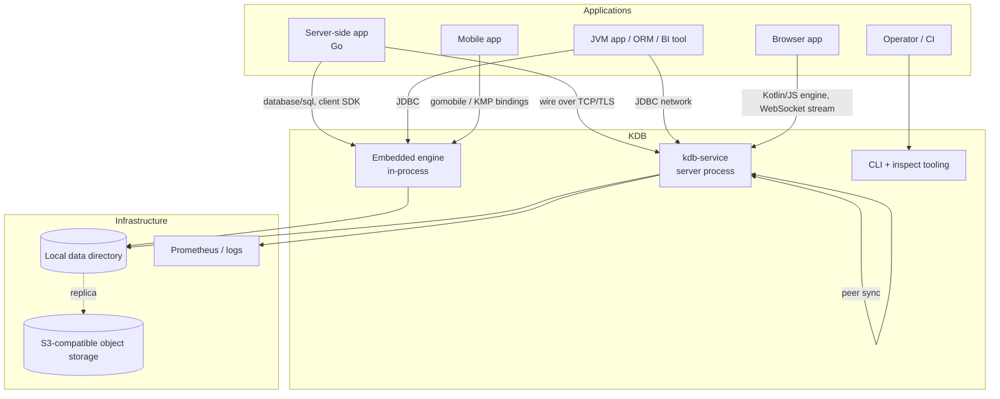
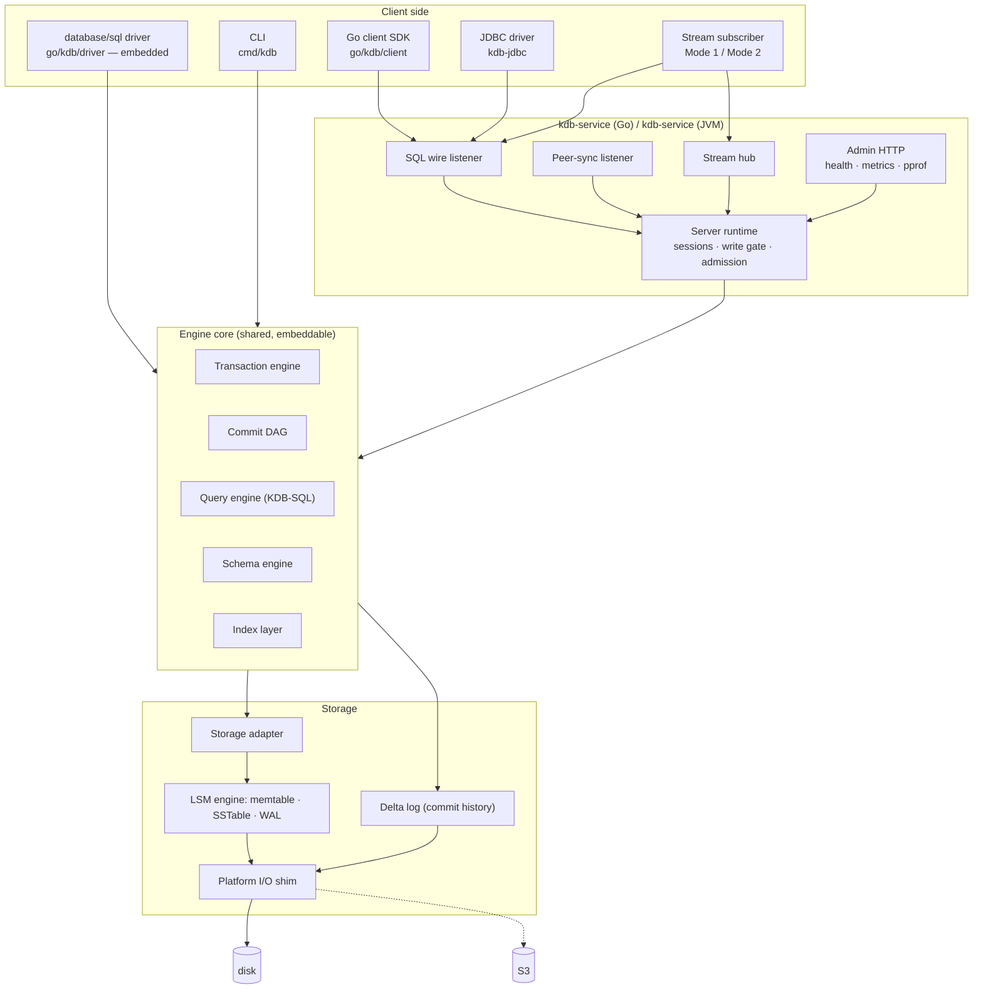
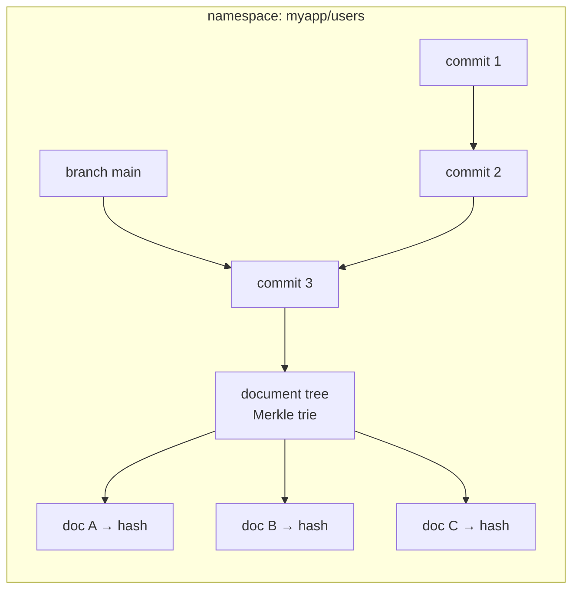
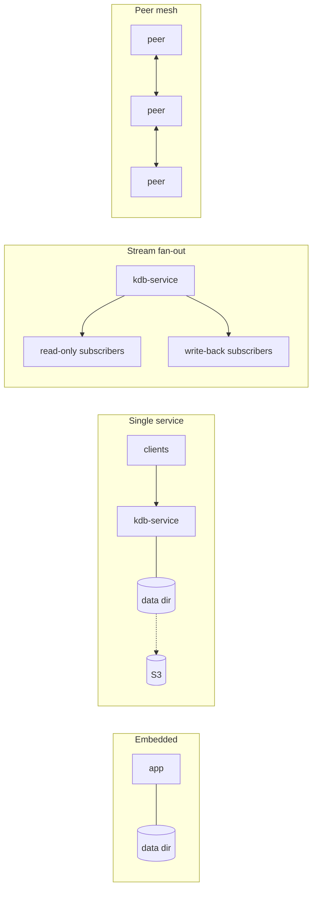
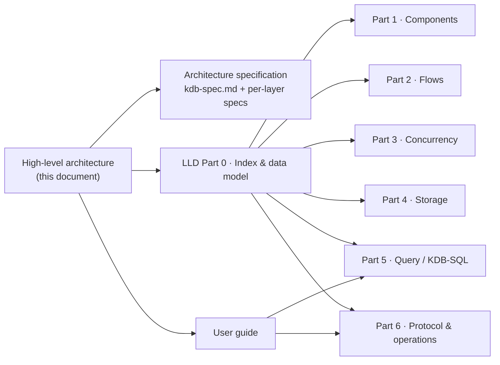

# KDB — High-Level Architecture

**Audience:** architects, reviewers, and anyone deciding whether and how to use KDB.
**Scope:** what the system is, how it is put together, why it is built this way, and what it
does and does not guarantee. Implementation detail lives in the low-level design; usage lives in
the user guide.

| If you want… | Read |
|--------------|------|
| the shape of the system and the reasoning behind it | **this document** |
| the normative design and roadmap | [Architecture specification](kdb-spec.md) |
| types, flows, locks, byte layouts, query semantics | [Low-level design, Parts 0–6](kdb-lld.md) |
| how to run, embed, and operate it | [User guide](kdb-user-guide.md) |

-----

## 1. What KDB is

KDB is a **portable embedded database engine for versioned JSON documents**. It is best
described as *source control for structured data*: you store whole JSON documents, you get whole
JSON documents back, and every change is an immutable commit in a per-namespace history that can
branch, diverge, merge, and be queried at any point in time.

A schema is optional. Declaring one adds a typed, indexable **lens** over fields that happen to
exist in your documents, which is what makes SQL, JDBC, and ORM integration possible — without
constraining what else a document may contain.

```
document store          + git-style history        + SQL lens
────────────────────────────────────────────────────────────────
whole JSON in/out         immutable commit DAG       typed columns
content-addressed         branches, tags, merge      indexes
UUID identity             point-in-time reads        JDBC / database/sql
```

### 1.1 Why it exists

Three needs that are usually met by three different systems:

1. **The same engine everywhere.** Browser, mobile, JVM service, native binary — one engine, one
   file format, one protocol. Not a client that talks to a server, but the whole database.
2. **History as a first-class feature.** Not audit tables bolted on: the storage model *is* a
   commit DAG, so "what did this look like last Tuesday", "who changed it", and "merge these two
   divergent replicas" are native operations.
3. **Documents and SQL without a translation layer.** Applications that want a document store,
   and the tooling ecosystem (BI, IDEs, ORMs) that wants SQL, over the same data at the same
   time.

### 1.2 What it is not

- Not a general-purpose SQL database. SQL is an index and query interface, not the storage model.
- Not a clustered database with a leader. Every peer is independent and equal; there is no
  consensus protocol and no authoritative node.
- Not a high-throughput event bus. It does not replace Kafka.
- Not a network-topology manager. Peer discovery is the application's responsibility.

-----

## 2. System context



-----

## 3. Architectural principles

These are the commitments everything else follows from. Each one has visible consequences in the
implementation.

| # | Principle | Consequence |
|---|-----------|-------------|
| P1 | **The document is the truth; the schema is a lens** | documents are stored byte-for-byte as supplied; `_doc` is always available alongside typed columns; a schema can be added or evolved without rewriting data |
| P2 | **Content addressing everywhere** | documents, trees, commits, and schemas are SHA-256 of their canonical encoding; unchanged content is shared across versions for free; verifying a commit verifies its history |
| P3 | **History is append-only** | commits are immutable; a branch is a movable pointer; "delete" writes a new snapshot that omits the document |
| P4 | **Peers are equal and may diverge** | no leader, no quorum; divergence is classified (fast-forward / already-ancestor / diverged) and either auto-merged when document sets are disjoint, or reported as a structured conflict |
| P5 | **Conflicts surface; they are never silently resolved** | the default policy reports; last-write-wins and custom resolvers are explicit opt-ins |
| P6 | **The same engine on every platform; only adapters differ** | the storage engine, DAG, and query engine are platform-independent; I/O sits behind one narrow shim |
| P7 | **Restart must never require recovery** | after any termination — clean, OOM-killed, `kill -9` — the log replays deterministically; no repair mode, no manual step |
| P8 | **Start only what we can finish** | operations reserve their estimated memory before running and are refused with a typed, actionable error otherwise, instead of the process being OOM-killed |
| P9 | **Clients are always told** | every failure is a typed error saying whether and when to retry; never a silently dropped request or a dead connection |
| P10 | **Two implementations, one specification** | Go and Kotlin are kept byte-compatible on disk and on the wire by golden tests |

-----

## 4. Container view



The engine core is the same code whether it runs inside a CLI process or behind a server. The
server adds **sessions, admission control, and listeners** — it does not change the semantics of
a commit.

-----

## 5. The data model in one page



| Concept | Definition |
|---------|-----------|
| **Namespace** | an independently versioned store (`catalog/collection`) with its own DAG, branches, storage, and RBAC scope |
| **Document** | a whole JSON object with a UUID identity, hashed by content |
| **Document tree** | a Merkle radix trie mapping document id → content hash; the snapshot of a namespace at one commit |
| **Commit** | immutable: parents, tree hash, operations, schema hash, author, timestamp, message — hashed as a whole |
| **Branch / tag** | named pointers into the DAG; `main` always exists |
| **Schema** | an optional, versioned, content-hashed set of typed field declarations |
| **Operation** | write (JSON patch), delete, file write (blob reference), or schema migration |

Because the tree is a persistent Merkle structure, committing costs *O(changed documents)*, not
*O(namespace size)*, and two versions that share content share memory and disk.

Detail: [LLD Part 0 §5](kdb-lld.md).

-----

## 6. Key architectural decisions

Each decision, the alternative it displaced, and why.

| # | Decision | Alternative | Rationale |
|---|----------|-------------|-----------|
| D1 | Two durable stores — a **delta log** for commits, an LSM store (WAL + memtable + SSTables) for blobs | one unified log | the commit log alone can rebuild a namespace, which makes backup, verify, and restore operate on one simple append-only artefact |
| D2 | Delta segments named by **zero-padded sequence** | random UUID names | file order *is* commit order for every object store and every `ListSegments`, without a separate index |
| D3 | Replay applies commits **topologically**, not in file order | trust the file order | a bug in ordering degrades to a slower open rather than a permanently unopenable namespace |
| D4 | Tolerate a **torn tail** on the newest segment only | strict validation, or blanket tolerance | the torn tail is the expected shape of an unclean shutdown; corruption anywhere else is real and must not be silently truncated |
| D5 | **One commit at a time per namespace**, via a bounded, deadline-aware write gate | a plain mutex; or optimistic head CAS | appending a commit reads and moves the head non-atomically; the gate adds the two outcomes a mutex cannot express — "queue full" and "your deadline passed" |
| D6 | **Durability decoupled from serialization**: fix log position under the gate, fsync after releasing it | fsync inside the critical section | lets concurrent commits share one physical sync instead of each paying a full one in strict sequence |
| D7 | **Byte-denominated admission control** with a dynamic non-granted floor | a boolean memory guard | the commit DAG grows monotonically by design; a reserve-before-you-start model turns that into a smooth throttle instead of an eventual OOM kill |
| D8 | Shed work **at the frame header**, before the body is read | shed after decoding | under the exact load where shedding matters, refusals must be the cheapest thing the server does |
| D9 | **Typed error codes with retry semantics** on every failure | error strings | clients must decide "retry / retry later / never retry / resubmit smaller" without parsing prose |
| D10 | **Sharded document storage** (64 lock domains) plus a staged write set | one map under one mutex | reads and writes to different documents proceed in parallel; staging gives free transaction rollback and "invisible until committed" |
| D11 | **Idempotent transactions** keyed by transaction id | dedupe by content or by client bookkeeping | a network timeout must not create a duplicate commit; the DAG indexes transaction id → commit for an O(1) answer |
| D12 | **Conflict detection by content hash** at base vs. target tree | head-equality checks | two clients writing different documents do not conflict; two writing identical content do not conflict |
| D13 | **Per-frame codec recording** in the delta and SSTable formats | a global compression setting | changing compression never invalidates existing data, and verification can tell a codec mismatch from corruption |
| D14 | **One writer per data directory**, enforced by an exclusive lock file | multi-process coordination | an embedded engine has no cross-process concurrency protocol; the lock makes the constraint explicit and immediate |
| D15 | **Go as the deployment target**, Kotlin as the multiplatform reference | one implementation | a Go service removes the JVM from the deployment (a decisive cost factor on small instances); Kotlin keeps browser/JVM/native reach; golden tests keep them identical |
| D16 | **Unique keys enforced by a registry in the commit path**, not by the index layer | wire the index layer into commits first | uniqueness is a correctness primitive and the index layer is a performance track; the registry is narrow, lives where the check must happen anyway, and becomes the index's backing store later rather than being thrown away |
| D17 | The unique registry is **derived state**, rebuilt on open | persist it beside the data | a derived structure with its own persistence path is a second source of truth and a second recovery bug; rebuilding costs one scan per open |
| D18 | **Preconditions ride on the transaction envelope**, not inside `Op` | put them in the op | an op is committed history and is hashed into the commit; a precondition is a request-time assertion about state that no longer exists once the commit lands. In the op it would change every commit hash to record something that is not a fact about the data |
| D19 | `ExpectContentHash` **compares literally**, diverging from content-addressed no-op semantics | inherit conflict detection's "identical content passes" | a compare-and-set asserts that the state is still the one the caller read, not that its own write would change anything |
| D20 | **Leases carry monotonic fence tokens** | TTL alone | an expiry without a fence hands the document to a new holder while the original still believes it owns it — two writers, each convinced it is exclusive. Worse than no locking |
| D21 | The commit path **asserts nothing is held by others** instead of taking locks | keep the take-all-then-release | writes are already serialized by the gate, so the locks bought nothing — but failing fast meant a writer waiting in the gate refused every other writer to the same document, turning contention into a storm of unclearable failures |
| D22 | **Two lock files** — attach (shared) and writer (exclusive) | one lock, readers take `LOCK_SH` | with one lock a read replica could attach only to a directory whose writer had stopped, i.e. it required the thing it replicates to be down |
| D23 | **Group commit measured, then deliberately not built** | batch transactions behind the gate | the gate costs 0.65 µs against a 19.7 µs commit, and durability grouping already exists (`PersistAsync` releases the gate once log position is fixed): file-backed commits run 528 µs/op in parallel vs 4022 µs/op serial. A batching layer would add cross-transaction complexity on the exact path correctness depends on, for a few percent |

-----

## 7. Quality attributes

### 7.1 Durability

| Guarantee | Mechanism |
|-----------|-----------|
| An acknowledged commit survives process death (default `--durability=sync`) | commit payload framed, appended, and fsynced before the call returns |
| A crash never requires a repair step | topological replay + torn-tail tolerance |
| Corruption is detected, not silently absorbed | CRC per frame and per block; `kdb-inspect verify` at two levels |
| Damage is recoverable | `repair-segments` (safe truncation/quarantine) and `restore` (verified union of multiple sources) |
| Off-host copies | manifest-defined backups (full and incremental) to a directory or S3; optional live replication of sealed segments |

Tunable: `async` durability (ack on queue, background flush) and `fast` sync mode (survives
process/OS crash but not power loss) trade the guarantee for an order of magnitude in cost.

### 7.2 Consistency

| Property | Behaviour |
|----------|-----------|
| Within a namespace | serialized commits; a transaction is all-or-nothing |
| Optimistic concurrency | conflicts detected per document by content hash; the loser gets a structured report, never a silent overwrite |
| Application invariants | `unique` schema fields are enforced on every write path against a registry checked inside the write serialization — two clients cannot both take one natural key |
| Conditional writes | insert-if-absent and compare-and-set as first-class primitives, with a retry helper that re-reads every attempt |
| Pessimistic holds | expiring, fenced document leases for work that spans round trips; a holder that stalls past its deadline is refused at commit rather than overwriting whoever took the document next |
| Read isolation | `SNAPSHOT` sessions pin a commit; `READ_COMMITTED` reads the live head; scans are not snapshots |
| Cross-process readers | read-only runtimes attach alongside a live writer and see a snapshot as of their open (or last `Refresh`) |
| Across namespaces | none — one runtime serves one namespace; there are no cross-namespace transactions |
| Across peers | eventual, application-controlled: peers converge when they choose to sync, and conflicts are surfaced |

### 7.3 Availability and degradation

The failure ladder is deliberate and observable:

```
healthy → shed the most deferrable work (scan budgets shrink)
        → refuse writes and scans, keep serving point reads
        → refuse everything but point reads, release the rescue reserve
        → orderly abort: drain, flush, exit 75, supervisor restarts clean
```

A point read is never shed, because a server that cannot answer one is indistinguishable from a
server that is down — and reads are how an operator diagnoses the pressure.

### 7.4 Performance characteristics

| Path | Shape |
|------|-------|
| Commit | O(changed documents × trie depth) for the tree, plus one shared fsync |
| Point read | one shard lock, one map lookup |
| Scan | streaming, batch-at-a-time; bounded by both rows returned and rows examined |
| Blob write | lock-free relative to other writers; group-committed fsync |
| Concurrency | reads scale with cores; writes serialize per namespace but overlap their disk work |

Measured calibration (Apple M3 Max): ~6.9 KiB retained per commit at small payloads, scaling as
`base + 1.25 × payload`; the cost model rounds that up deliberately, because under-estimating is
the dangerous direction.

Write-path measurements on the same machine (`server/write_gate_profile_test.go`):

| | serial | parallel (16) |
|---|---|---|
| in-memory commit | 19.7 µs/op | 23.2 µs/op |
| file-backed commit | 4022 µs/op | **528 µs/op** |
| write gate primitive alone | — | 0.65 µs/op |

The gate costs ~3 % of a commit, and concurrency makes file-backed writes **7.6× faster** than
serial — because durability grouping already happens (`PersistAsync` releases the gate as soon as
a commit's log position is fixed, so concurrent commits share one physical sync). That is why a
batching group-commit layer was measured and then deliberately not built (D23). Benchmarks:
`docs/benchmarks/`.

### 7.5 Security

| Aspect | Status |
|--------|--------|
| Transport | TLS and mTLS on every listener; no silent downgrade |
| Authentication | user/password or token at handshake; PBKDF2-HMAC-SHA256 with per-user salt |
| Authorization | resource-scoped RBAC (database / collection / document) enforced at four independent points |
| Registry durability | users and roles are versioned documents in reserved namespaces |
| Encryption at rest | **specified, not implemented** (Layer 14) |
| Admin endpoint | unauthenticated by design — bind it privately |

### 7.6 Portability

| Target | Status |
|--------|--------|
| Native server / CLI (Go) | primary deployment target |
| JVM (Kotlin) | full engine, JDBC, service |
| Browser | Kotlin/JS engine, WebSocket stream, browser demo; Go WASM build |
| Mobile | `go/kdb/embed` binds directly via gomobile on iOS and Android |
| Object storage | S3-compatible replica tier and backup target |

-----

## 8. Deployment topologies



| Topology | Use it when | Constraint |
|----------|-------------|------------|
| Embedded | single-process apps, CLIs, tests, mobile, browser | one **writer** per data directory; read-only attachments may run alongside it (unix) |
| Single service | shared access, RBAC, TLS, remote SQL, concurrent application instances | one namespace per runtime; writes serialize, but unique keys, CAS, and leases make concurrent writers safe |
| Stream fan-out | live read models, browser clients, caches | subscribers may lag and resync from their last ack |
| Peer mesh | offline-first, edge, multi-site | convergence is explicit; conflicts are the application's to resolve |

-----

## 9. Cross-cutting concerns

| Concern | Approach |
|---------|----------|
| **Configuration** | `defaults < config file < KDB_* env < explicit flags`; unknown config keys fail at startup |
| **Observability** | Prometheus metrics (including governance counters), structured logs, health/readiness, pprof |
| **Build identity** | every binary reports version + commit + dirty flag; the same identity appears in logs, `/healthz`, and a `kdb_build_info` gauge |
| **Testing** | unit tests per layer, cross-language golden fixtures, integration suite, load and pressure harnesses, race-detector runs |
| **Tooling** | `kdb-inspect` for verify / repair / backup / restore / frame dumps, all taking the same data-directory lock a live service would |
| **Compatibility** | additive wire fields, versioned frame formats, refusal (never guessing) on unrecognised legacy formats |

-----

## 10. Status and maturity

| Area | Maturity |
|------|----------|
| Core engine (codec, document, DAG, transactions, storage) | implemented and tested in both trees |
| Durability, crash recovery, integrity, backup/restore | implemented (Go), spec-backed (Layer 13/15) |
| Resource governance | implemented (Go) |
| Go-native server, client SDK, RBAC, TLS | implemented |
| Multi-writer safety — unique keys, compare-and-set, leases with fencing | implemented (Go) |
| Cross-process read-only replicas | implemented (Go, unix) |
| KDB-SQL | Go: `SELECT` / `INSERT` / `CREATE TABLE`, full scan only. Kotlin: joins, group-by, DML, DDL, views, GRANT/REVOKE |
| Index layer | versioned engine implemented; **not yet consulted by the Go planner** |
| Historical reads | commit resolution implemented; document materialisation at an arbitrary commit is a known gap |
| Peer sync | implemented, with fast-forward/merge/conflict classification |
| Stream modes | Mode 1 and Mode 2 implemented over TCP and the in-memory hub |
| Encryption at rest | specified only |
| GPU compute | adapter surface with CPU fallback |

Known limitations are listed exhaustively in [LLD Part 5 §7](kdb-lld-query.md) (query) and
[Part 3 §13](kdb-lld-concurrency.md) (concurrency).

-----

## 11. Risks and their mitigations

| Risk | Impact | Mitigation |
|------|--------|------------|
| The in-memory commit DAG grows monotonically | memory exhaustion under sustained writes | admission control's non-granted floor throttles smoothly; DAG squash and the ice tier reclaim; the abort watchdog restarts clean rather than lingering degraded |
| Unique enforcement is off unless the engine is constructed with it | an embedded caller using `transaction.NewEngine` gets no enforcement and silently ignores preconditions | the server always wires both; embedded callers must pass `EngineOptions` |
| The unique registry rebuilds by scanning on open | open cost grows with namespace size | measured per open; a snapshot with `IsValid`-style validation is the documented follow-up if it becomes unacceptable |
| Composite (multi-field) uniqueness is not implemented | a two-column natural key cannot be declared | single-field only today, matching `schema.Field.Unique` |
| Read replicas are unix-only | no shared lock mode elsewhere | the non-`flock` fallback refuses rather than silently degrading |
| No index usage in the Go planner | full scans on large namespaces | scan row budgets bound the damage and return `RESOURCE_EXHAUSTED`; use the Kotlin engine or keep namespaces small until the planner consults indexes |
| Historical reads return current documents | point-in-time queries can mislead | documented; use commit-scoped tooling and peer/backup snapshots where exactness matters |
| One writer per data directory | no multi-process embedded writes | enforced immediately by lock, with a clear error; use the server for shared access |
| Two implementations can drift | subtle incompatibility | golden fixtures for every shared format; format changes originate on the Kotlin side |
| No encryption at rest | data readable from a stolen volume | disk/volume encryption at the platform level until Layer 14 lands |

-----

## 12. Documentation map



| Document | Purpose |
|----------|---------|
| [kdb-spec.md](kdb-spec.md) | normative specification, layer plans, roadmap, interface registry |
| [kdb-lld.md](kdb-lld.md) | LLD Part 0 — index, system architecture, core data model |
| [kdb-lld-components.md](kdb-lld-components.md) | LLD Part 1 — every package and type |
| [kdb-lld-flows.md](kdb-lld-flows.md) | LLD Part 2 — end-to-end sequences |
| [kdb-lld-concurrency.md](kdb-lld-concurrency.md) | LLD Part 3 — goroutines, locks, ordering, backpressure |
| [kdb-lld-storage.md](kdb-lld-storage.md) | LLD Part 4 — on-disk formats and in-memory structures |
| [kdb-lld-query.md](kdb-lld-query.md) | LLD Part 5 — KDB-SQL reference and execution |
| [kdb-lld-protocol.md](kdb-lld-protocol.md) | LLD Part 6 — wire protocol, governance, security, operations |
| [kdb-user-guide.md](kdb-user-guide.md) | running, embedding, and operating KDB |
| [go-porting.md](go-porting.md) | Go module layout and cross-language rules |
