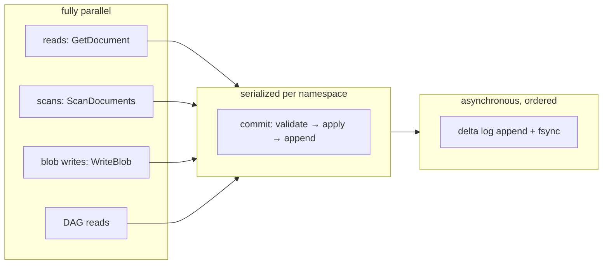
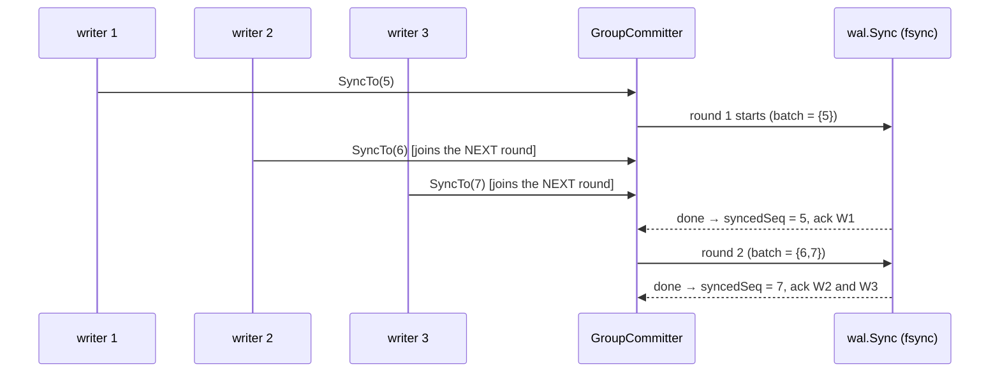
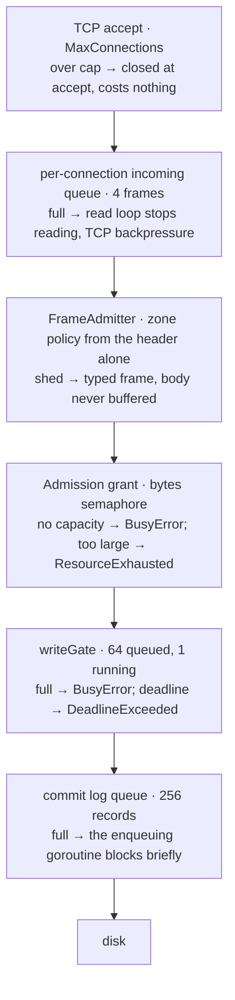

# KDB — Low-Level Design

## Part 3 · Concurrency Model

**Parent:** [Part 0 — Index & architecture](kdb-lld.md) · **See also:**
[High-level architecture](kdb-architecture.md) · [Components](kdb-lld-components.md) ·
[Flows](kdb-lld-flows.md) · [Storage](kdb-lld-storage.md) · [Query](kdb-lld-query.md) ·
[Protocol](kdb-lld-protocol.md) · [User guide](kdb-user-guide.md)

This part is the authoritative account of what runs in parallel, what protects what, in which
order locks may be taken, and where the sharp edges are.

-----

## 1. The concurrency model in one paragraph

KDB is a **goroutine-per-connection server around a single-writer engine core**. Reads are
massively parallel: document storage is sharded 64 ways, the commit DAG is behind a
reader/writer lock, and nothing on the read path takes an exclusive engine lock. Writes are
serialized to exactly one in-flight commit per namespace by the write gate, because appending a
commit means reading the head, validating against it, and only then appending — a sequence that is
not atomic, even though each step is. Durability is decoupled from that
serialization: a commit's *position* in the log is fixed under the gate, but its *fsync* happens
after the gate is released, on a dedicated drain goroutine that coalesces concurrent commits into
one physical sync. Every queue in the system is bounded, and every bound rejects with a typed
error rather than growing.



-----

## 2. Every goroutine in a running `kdb-service`

| Goroutine | Started by | Lifetime | Job |
|-----------|-----------|----------|-----|
| accept loop (per listener) | `ListenSqlWire` / `ListenPeerSync` / `ListenStream` → `transport.Serve` | until `Listener.Close` | accept, enforce `MaxConnections`, spawn a connection |
| connection read loop (per connection) | `tcp.newSocketConnection` | until close/EOF | read frames, apply the `FrameAdmitter`, deliver on `incoming` |
| connection handler (per connection) | `Serve`'s handler callback | until `incoming` closes | decode → dispatch → encode reply |
| commit-log drain | `newCommitLogWriter` (one per file-backed runtime) | until `Close` | batch, frame, append, fsync, ack |
| group-commit round | `GroupCommitter.SyncTo` (transient) | one batch | call `wal.Sync` once for all waiting writers |
| WAL async syncer | `ServerEngine.startAsyncSync` (only under `--durability=async`) | until `Close` | periodic `wal.Sync` |
| memory sampler | `NewMemoryGuard` (only when a budget is configured) | until `Stop` | 200 ms sample → zone state machine → observer |
| abort watchdog | `NewAbortWatchdog(...).Start()` (only with `--abort-after`) | until `Stop`/abort | poll sustained pressure; run the abort sequence |
| admin HTTP server | `NewAdminServer` | until `Close` | `/healthz`, `/readyz`, `/metrics`, pprof |
| client read loop | `client.Connect` (SDK side) | until `Close` | demultiplex responses by correlation id |

An **embedded** runtime (CLI, JDBC, `database/sql`, WASM) starts only the commit-log drain,
group-commit rounds, and — under async durability — the WAL syncer. There is no accept loop, no
sampler, and no watchdog.

-----

## 3. Every lock, and what it protects

### 3.1 Engine core

| Lock | Type | Protects | Held during |
|------|------|----------|-------------|
| `dag.InMemoryCommitDag.mu` | `RWMutex` | commits, stubs, trees, branches, tags, `hexSorted`, `txIndex`, `ancestryVersion` | map access, hash verification on `PutCommit`, ancestry closure walks |
| `transaction.LockManager.mu` | `Mutex` | `map[(namespace,docID)]sessionID` | one map operation |
| `ServerEngine.treeMu` | `Mutex` | the running `DocumentTree` | the whole of `CommitTree` |
| `shardedDocStore.shards[i].mu` ×64 | `Mutex` | committed documents in shard *i* | one map op, or one shard copy in `Range` |
| `shardedPendingStore.shards[i].mu` ×64 | `Mutex` | staged puts/deletes in shard *i* | one map op |
| `memtable.SortedTable.mu` | `Mutex` | entries + size accounting | one entry op or a snapshot copy |
| `memtable.Manager.mu` | `Mutex` | active / pendingFlush pointers | pointer swap only — never the SSTable write |
| `sstable.BlockCache.mu` | `Mutex` | cached blocks + FIFO order | one lookup or insert+evict |
| `sstable.LsmBlobStore.mu` | `Mutex` | the table handle slice | slice read (copy) or copy-on-append |
| `index.eventLog` mutex | `Mutex` | event slices + bucket memo | append, or one replay |

### 3.2 Storage I/O

| Lock | Type | Protects | Notes |
|------|------|----------|-------|
| `wal.DefaultWriteAheadLog.mu` | `Mutex` | sequence counter, segment chain, active segment size, closed flag | held across `AppendToSegment` so sequence order equals byte order |
| `wal.GroupCommitter.mu` | `Mutex` | waiter list, `syncedSeq`, `inFlight` | **never held across `doSync`** |
| `FileBackedPlatformIO.globalMu` | `Mutex` | the per-segment mutex map and the sealed-segment set | short critical sections only |
| `FileBackedPlatformIO` per-segment mutex | `Mutex` | one segment's append/read/seal/delete | **not taken by `FlushSegment`** — see §5 |
| `OSByteStore.mu` | `Mutex` | the open-file handle cache | append itself is `O_APPEND` + `atomic.AddInt64` on size |
| `delta.DefaultWriter.mu` | `Mutex` | segment size, first/last commit, sealed flag | one frame append |
| `embed.commitLogWriter.mu` | `Mutex` | the fail-stop failure latch | trivial |
| `embed.commitLogWriter.sendMu` | `RWMutex` | makes closing the request channel safe against in-flight sends | readers send, writer closes |

### 3.3 Server

| Lock | Type | Protects |
|------|------|----------|
| `writeGate.queued` / `.running` | buffered channels (64 / 1) | admission to commit; the `running` channel *is* the mutual exclusion |
| `KdbServerRuntime.schemaMu` | `RWMutex` | `Runtime.Schema` (mutated by `CREATE TABLE`) |
| `KdbServerRuntime.closeMu` | `Mutex` | the close-once path in `Release` |
| `Admission.sem` | `semaphore.Weighted` | grant capacity in bytes |
| `Admission.floorMu` | `Mutex` | `floorHeld` (the non-granted floor) |
| `MemoryGuard.mu` | `Mutex` | sample ring, candidate zone, dwell timestamp |
| `MemoryGuard.observerMu` | `RWMutex` | the observer callback pointer |
| `SessionManager.mu` | `Mutex` | the session map |
| `StreamHub` mutex | `Mutex` | the subscriber registry |
| `ServerRuntimeRegistry.mu` | `Mutex` | key → runtime map |
| `peersync.divergenceLocks` | `Mutex` guarding a map of per-namespace `Mutex`es | one namespace's divergence resolution |

### 3.4 Atomics (lock-free state)

`MemoryGuard.zone`/`pressure`; `Admission.outstandingBytes`/`outstandingOps`/`scanRowBudget`/
`reserveLost`/`lastZone` and all `AdmissionStats` counters; `KdbServerRuntime.refCount`/
`draining`; `AdminServer.ready`/`notReadyReason`; `Grant.released`; `OSByteStore.openSegment.size`;
`SessionManager.idSeq`. These are all read on hot paths where a mutex would be the wrong trade.

-----

## 4. Lock ordering

The full acquisition order. Taking locks in this order is deadlock-free; nothing in the codebase
takes them in any other order.

```
1.  Admission.sem              (bytes; blocking, but only on a context with a deadline)
2.  writeGate.queued → running (bounded; deadline-aware)
3.  peersync per-namespace lock (peer paths only)
4.  transaction.LockManager.mu  (documents, acquired in sorted id order)
5.  dag.mu
6.  ServerEngine.treeMu
7.  shardedDocStore / shardedPendingStore shard mutexes
8.  memtable.Manager.mu → SortedTable.mu → LsmBlobStore.mu → BlockCache.mu
9.  wal.mu → FileBackedPlatformIO per-segment mutex → OSByteStore.mu
10. FileBackedPlatformIO.globalMu   (leaf: always released before doing I/O)
```

Rules the code follows, each of which is load-bearing:

- **No blocking I/O under a shared lock.** `wal.Sync` reads the segment name under `mu`, releases,
  then flushes. `GroupCommitter` calls `doSync` with no lock held. `memtable.Manager.Flush` swaps
  generations under `mu` then writes the SSTable unlocked.
- **No blocking acquisition under a lock.** `Admission.applyFloor` runs on the sampler goroutine
  and uses `sem.TryAcquire` only — a blocking acquire there would stop the very measurements that
  decide when to give capacity back.
- **Document locks are taken in sorted order** (`AcquireAllForTransaction` sorts by id string), so
  two transactions touching overlapping document sets can never deadlock; on failure, only the
  locks *this call* newly granted are released.
- **Per-shard, not per-store.** Document reads and writes to different shards never contend.
- **Scan copies a shard, then releases.** `shardedDocStore.Range` copies one shard's documents
  under its lock and visits them unlocked, so a slow batch callback never stalls writers.

-----

## 5. Where locks are deliberately *not* taken

Three exclusions are load-bearing and easy to "fix" into a performance collapse:

1. **`ServerEngine.WriteBlob` takes no engine-wide lock.** `WAL.Append` and `memTable.Put` are
   each independently thread-safe, and durability comes from `GroupCommitter`. Adding an engine
   mutex here would serialize every writer behind each fsync.
2. **`FileBackedPlatformIO.FlushSegment` does not take the per-segment mutex.** That mutex also
   guards `AppendToSegment`; sharing it would make every writer wait for the full duration of an
   fsync, silently defeating group commit. It is safe because `SegmentByteStore` implementations
   must tolerate a flush concurrent with appends (true of `os.File.Sync` with `O_APPEND` writes).
3. **`AppendCommit` does not re-verify the commit hash.** Re-deriving it means re-encoding the
   payload and re-running SHA-256 on the hot path, for a commit the engine built microseconds
   earlier. `PutCommit` — the path for commits from peers and from replay — does verify.

-----

## 6. The write gate

```go
type writeGate struct {
    queued  chan struct{} // capacity = DefaultMaxQueuedWrites (64)
    running chan struct{} // capacity 1 — the actual mutual exclusion
}
```

`acquire(ctx)` has exactly three outcomes:

| Outcome | Condition | Client sees |
|---------|-----------|-------------|
| granted | a `running` slot became free before the deadline | the commit runs |
| `*BusyError{RetryAfterMs: 50}` | `queued` was already full — the queue is not even joined | `BUSY`, retry later |
| `*DeadlineExceededError` | queued, but `ctx` (default 5 s `WriteTimeout`) expired first | `DEADLINE_EXCEEDED`, retry with a longer deadline |

**Why a gate rather than a mutex.** `InMemoryCommitDag.AppendCommit` advances the branch head
unconditionally — there is no compare-and-swap against the anchor it was handed. Two goroutines
racing on the same stale head would silently orphan one of them from `main` rather than surfacing
a conflict. A bare mutex would provide the same exclusion but could express neither "the queue is
already too long" nor "this caller's deadline passed", so an overloaded server would accumulate
unbounded blocked goroutines with no way to distinguish a healthy wait from a hopeless one.

`quiesced()` reports an empty gate, which is how `WaitForWritesToDrain` knows an orderly shutdown
may proceed — meaningful only after `BeginDraining` stops new admissions.

> ⚠️ **Embedded callers get no gate.** `embed.PutJSONDocument` and direct
> `transaction.Engine.Commit` calls against a shared `*InMemoryCommitDag` are **not** internally
> serialized. Single-threaded use (the CLI, one JDBC connection at a time) is safe; a
> multi-threaded embedder must serialize its own commits or route them through a
> `KdbServerRuntime`.

-----

## 7. Group commit — two independent implementations

Both exist because two different logs need coalescing, and they are not interchangeable.

### 7.1 Blob WAL — `wal.GroupCommitter`



Correctness rests on one rule: a waiter that arrives while a sync is **already in flight** is
deferred to the next round, because its append may not have happened-before that fsync started.
`SyncTo(seq)` returning nil means every write through `seq` is durable.

### 7.2 Commit log — `embed.commitLogWriter`

A single drain goroutine owns the delta writer. Callers enqueue under the write gate (so queue
order is commit order), then wait *outside* it.

| Property | Value |
|----------|-------|
| queue | buffered channel, 256 entries |
| batch | up to 256 records per flush — a latency guard, not a throughput knob |
| ack | under `Sync`, after the batch's `Flush()`; under `Async`, at enqueue time |
| failure | **latched**: once an append or flush fails, every later enqueue fails too — a log with a hole must not be appended to |
| close | `sendMu` (RW) makes closing the channel safe against an in-flight send; the drain keeps consuming so a blocked sender cannot deadlock `Close` |

-----

## 8. Backpressure chain

Every stage is bounded, and each bound has a distinct, typed refusal:



The per-connection buffer was reduced from 32 frames to 4: at the 16 MiB max frame size, 32
frames is a 512 MiB per-connection commitment that nothing accounted for. Four keeps pipelining
clients from stalling on every request while bounding the unaccounted commitment.

Two properties worth stating explicitly:

- **A dropped frame is never an acceptable outcome.** The transport read loop *blocks* on a full
  queue rather than dropping (an earlier `select/default` silently lost requests and replies); it
  is interrupted only by the connection's `done` channel.
- **A shed request always gets a reply.** The frame admitter only sheds message types for which a
  typed rejection frame can be built; anything else is admitted and left to the normal path,
  because a dropped request with no reply leaves the client blocked until its own timeout.

-----

## 9. Admission control as a concurrency primitive

`Admission` is a byte-denominated semaphore, not a request counter:

```
capacity        = memoryLimit − rescueReserve            (fixed at construction)
usable capacity = capacity − floorHeld                   (recomputed every 200 ms sample)
floorHeld       = clamp(smoothedUsage − outstandingGrants, 0, capacity − 1 MiB)
```

`floorHeld` is expressed as bytes of the semaphore permanently held, rather than by resizing the
semaphore (which `semaphore.Weighted` cannot do). This is the mechanism that turns *"the commit
DAG grows monotonically by design"* from an eventual OOM into a smooth throttle: as retained
history grows, the floor rises, usable grant capacity shrinks, and writes get progressively
harder to admit — while the floor-stop (`capacity − 1 MiB`) guarantees at least one maximally
sized operation always remains admissible, so the node can always work off its backlog.

Grants are held for the operation's real lifetime, including the durability wait — releasing at
the write gate would let the next writer be admitted against capacity that has not actually been
returned.

-----

## 10. Visibility and atomicity guarantees

| Guarantee | Mechanism |
|-----------|-----------|
| A staged write is invisible to readers until commit | `pending` is a separate store; `GetDocument` reads `docs` only |
| A failed write phase leaves nothing behind | `DiscardPending` clears all 64 pending shards |
| `CommitTree` is atomic with respect to readers | `treeMu` held across the whole apply; the tree pointer swaps once |
| A commit is either fully in the DAG or not at all | `putCommitLocked` inserts under the write lock after verification |
| Delta-log order equals DAG order | enqueue under the write gate + single drain goroutine |
| A retried transaction is idempotent | `txIndex` first-wins mapping from transaction id to commit |
| Index answers are stable for an unchanged DAG | bucket memo keyed on `(cutoff, event counts, ancestryVersion)` |
| A blob is durable when `WriteBlob` returns (sync mode) | `GroupCommitter.SyncTo` completes before return |
| A commit is durable when `Commit` returns (sync mode) | `PersistAsync`'s `wait()` completes before return |

**What is *not* guaranteed:** `ScanDocuments` is not a snapshot. Shards are copied sequentially,
so a scan that starts before a commit and ends after it may observe documents from both states.
Queries that need a stable view pass an explicit `AtCommit` (SNAPSHOT sessions, `AT COMMIT`
clauses) — and even then, the current `ServerEngine` returns *current committed* documents rather
than reconstructing the historical tree, which is a documented limitation (see
[Part 5 §7](kdb-lld-query.md)).

-----

## 11. Peer sync serialization

`ResolveDivergence` reads the head, decides, and then mutates the DAG across several non-atomic
calls (`SetHead`, or `AppendMergeCommit` after building a merge tree). Two concurrent callers —
two connections pushing to the same host, or a push racing a pull — would otherwise both read the
same stale head and both mutate, reopening the fork/lost-update class of bug one level up from
the unconditional `SetHead` this function replaced.

It is therefore serialized by a **per-namespace mutex** held in a package-level map. Ordering
relative to the write gate: peer-sync commits that go through `KdbServerRuntime` take the gate
*inside* the divergence lock, never the reverse.

-----

## 12. Session and connection state

| State | Scope | Concurrency |
|-------|-------|-------------|
| authenticated principal | one connection | written once at handshake; read-only thereafter |
| `SessionManager` map | one connection | mutex-guarded; sessions are per-connection, matching the Kotlin `SqlWireHost` per-`ConnectionContext` model |
| `KdbSession.Pending` builder | one session | assumed single-threaded per session — a client pipelining two `INSERT`s on the same session id must not do so concurrently |
| document locks | server-wide, keyed by session id | released on `TX_COMMIT`, `TX_ROLLBACK`, and on disconnect (`ReleaseAll`), so a dropped connection cannot leak locks |
| `ReadPin` | one session | set at begin under SNAPSHOT; immutable afterwards |

-----

## 13. Known hazards and their mitigations

| Hazard | Where | Mitigation / status |
|--------|-------|---------------------|
| Concurrent `AppendCommit` on a shared DAG orphans a commit | `dag` has no CAS on head | serialized by `writeGate` in the server; **embedded multi-threaded callers must serialize themselves** |
| A slow subscriber blocking the fan-out | `StreamHub.Publish` | fan-out is best-effort and non-blocking; a subscriber that cannot keep up misses frames and resyncs from its last ack |
| Tombstones lost at flush | `memtable.Manager.Flush` | documented: the SSTable format has no delete marker, so a delete of an already-flushed blob holds only while its tombstone is in memory. A format change must originate on the Kotlin side |
| Cost-model feedback under concurrency | `Admission`/`CostModel` | actuals come from `sql.ExecStats` (exactly attributable per query), never from process-wide allocation counters, which were unattributable under concurrency |
| `Grant` released twice | `defer grant.Release()` plus explicit paths | `Release` is idempotent via `atomic.Bool` CAS |
| Write gate released twice | success path releases early, `defer` releases otherwise | `sync.Once` (`releaseOnce`) |
| Sealed-segment races | `FileBackedPlatformIO` | seal is idempotent; a sealed segment rejects further appends with a typed error |
| Registry ref-count leak | `ServerRuntimeRegistry` | `NewKdbServerRuntime` starts at 1 (the first caller's own reference); the entry is removed when the count reaches zero |

-----

## 14. Testing the concurrency model

The properties above are covered by targeted tests rather than by inspection:

| Property | Test |
|----------|------|
| Concurrent commits on the same base version produce exactly one winner | `client.TestConcurrentCommitsRacingSameBaseVersion` |
| Append-only writes never conflict under concurrent writers | `client.TestAppendEventNeverConflictsUnderConcurrentWriters` |
| A full write queue produces `BUSY` over a real socket | `client.TestUpsertReturnsErrBusyOverRealWireWhenWriteQueueIsFull` |
| DAG mutation under concurrent readers | `dag/concurrency_test.go` |
| Group commit coalesces without losing durability | `wal` group-commit tests, `transaction/commit_throughput_bench_test.go` |
| Close does not leak file handles or lose queued commits | `embed/file_leak_test.go`, `embed/close_seals_test.go`, `embed/durability_test.go` |
| Locks are released on disconnect | wire listener tests |

Run the race detector over the whole tree:

```bash
cd go && go test -race ./...
```

-----

## Cross-references

- What each lock protects, structurally: [Part 1 — Components](kdb-lld-components.md)
- Where these locks are taken in a request: [Part 2 — Flows](kdb-lld-flows.md)
- The durability semantics the gate and drain implement: [Part 4 — Storage](kdb-lld-storage.md)
- Zone policy and typed refusals: [Part 6 — Protocol](kdb-lld-protocol.md)
