# KDB — Low-Level Design

## Part 2 · Flows

**Parent:** [Part 0 — Index & architecture](kdb-lld.md) · **See also:**
[High-level architecture](kdb-architecture.md) · [Components](kdb-lld-components.md) ·
[Concurrency](kdb-lld-concurrency.md) · [Storage](kdb-lld-storage.md) ·
[Query](kdb-lld-query.md) · [Protocol](kdb-lld-protocol.md) ·
[User guide](kdb-user-guide.md)

Every significant path through the system, as a sequence. Each flow names the exact functions
involved so the diagram can be walked in the source.

**Flow index**

| # | Flow | Entry point |
|---|------|-------------|
| 1 | Opening an embedded file runtime | `embed.OpenFileRuntimeWithOptions` |
| 2 | Embedded write (`kdb put`) | `embed.PutJSONDocument` |
| 3 | Transaction commit — the full engine sequence | `transaction.defaultEngine.Commit` |
| 4 | Blob write and durability | `ServerEngine.WriteBlob` |
| 5 | Commit durability (delta log) | `PersistingCommitDAG.PersistAsync` |
| 6 | Connect, handshake, session begin | `sqlWireConnHandler.handleHandshake` |
| 7 | SQL `SELECT` over the wire | `sqlWireConnHandler.execRead` |
| 8 | `INSERT` + `TX_COMMIT` | `execInsert` → `handleTxCommit` |
| 9 | Point read (`DOCUMENT_GET`) and `UPSERT` | `handleDocumentGet` / `handleUpsert` |
| 10 | Conflict and client retry | `detectConflicts` → `ConflictReport` |
| 11 | Crash recovery / delta replay | `embed.replayDeltaNamespace` |
| 12 | Peer sync (Mode 3) | `peersync.Client.PullMissing` / host `CommitPush` |
| 13 | Stream Mode 1 fan-out and Mode 2 write-back | `StreamHub.Publish` / `TransactionReplayer` |
| 14 | Memory pressure and shedding | `MemoryGuard.observe` → `Admission` |
| 15 | Orderly shutdown and abort | SIGTERM path / `AbortWatchdog` |
| 16 | Verify and repair | `integrity.Verify` → `integrity.Repair` |
| 17 | Backup and restore | `backup.Create` → `recovery.HybridRestore` |
| 18 | Schema DDL and migration | `DDLExecutor` / `schema.ApplyMigration` |
| 19 | RBAC enforcement points | `auth.Engine` at four layers |

-----

## 1. Opening an embedded file runtime

The single most consequential startup path: it takes the directory lock, rebuilds all in-memory
state from the durable log, and decides whether the namespace is openable at all.

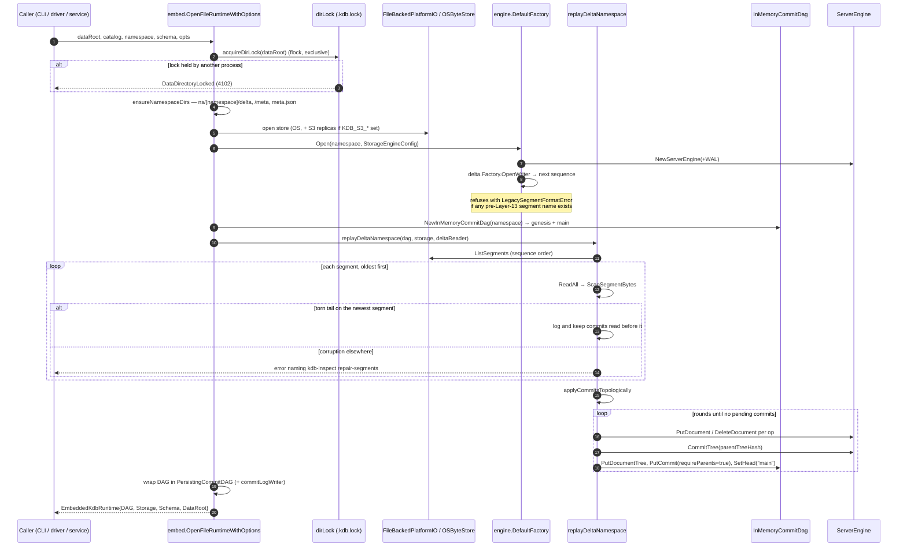

**Why replay is round-based rather than file-ordered.** Segment file order *is* commit order by
construction (zero-padded sequence names), but replay does not depend on it: a commit is applied
only once every parent is present. A bug in ordering therefore degrades to a slower open, not a
permanently unopenable namespace — which is exactly the failure mode Layer 13 Component 47 was
written to remove.

**Close is the mirror image** and is deliberately *not* load-bearing: `Close()` drains the commit
log, flushes and seals the active delta segment, closes the engine handle (final WAL sync), then
releases the directory lock. Skipping all of it (`kill -9`) is safe — it only means the next open
pays for a torn-tail scan and leaves one extra small segment behind.

-----

## 2. Embedded write — `kdb put`

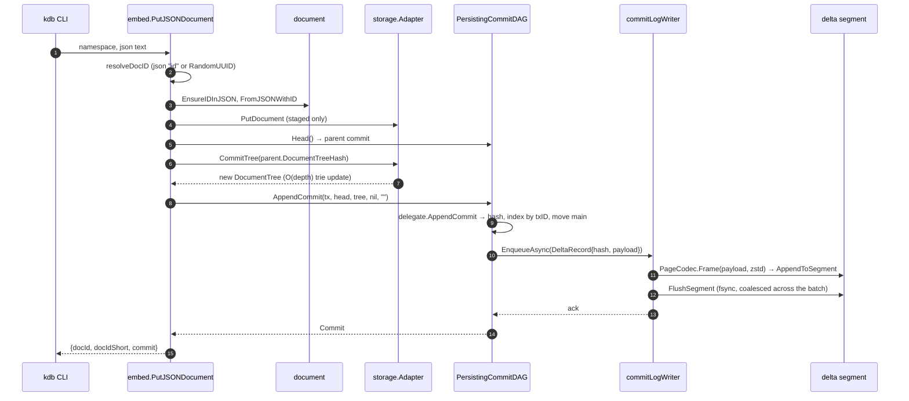

`kdb get` resolves its argument as either a full UUID or an **unambiguous 8+ hex prefix**
(`resolveDocSelector`), then reads through `storage.Adapter.GetDocument` at the head commit's
tree hash.

-----

## 3. Transaction commit — the full engine sequence

This is the heart of the write path. It runs identically for embedded and server callers; the
server merely wraps it in admission, authorization, and the write gate.

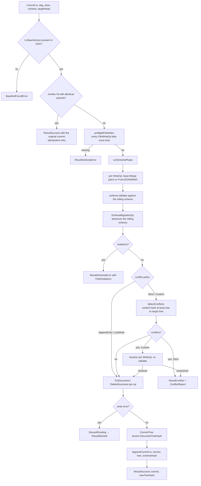

**Conflict classification** (`detectConflicts`) compares, per touched document, the content hash
at the transaction's *base* tree against the hash at the *target* (current head) tree:

| base | target | classification |
|------|--------|----------------|
| equal hashes | — | not a conflict (someone wrote the same content) |
| both absent | — | not a conflict |
| present, changed | present | `ConcurrentWrite` |
| absent | present | `DeleteWrite` |
| present | absent | `WriteDelete` |

**Server wrapper** (`KdbServerRuntime.runTransaction`), in cheapest-first order:

```mermaid
sequenceDiagram
    autonumber
    participant H as wire handler
    participant RT as KdbServerRuntime
    participant AD as Admission
    participant WG as writeGate
    participant TE as transaction.Engine
    participant PD as PersistingCommitDAG
    participant CL as CommitListener (stream hub)

    H->>RT: Commit/Upsert/Replay
    RT->>RT: draining? → UnavailableError
    RT->>RT: authorizeOperations (per-op RBAC)
    RT->>AD: Acquire(ctx, ClassWrite, payloadBytes)
    AD-->>RT: Grant  (or MemoryPressureError / BusyError / ResourceExhaustedError)
    RT->>WG: acquire(ctx)  (queue full → BusyError; deadline → DeadlineExceededError)
    RT->>TE: Commit(...)   ← the flow above
    TE-->>RT: ResultSuccess
    RT->>PD: PersistAsync(commit)   [queued under the gate: queue order = commit order]
    RT->>WG: release  ← as soon as log position is fixed
    RT->>PD: wait()   [fsync happens off the gate; concurrent commits share it]
    RT->>CL: CommitListener(namespace, commit)
    RT->>AD: Grant.Release (deferred — held across the durability wait)
    RT-->>H: Commit
```

The two release points are the performance-critical detail: the **gate** is released once the
commit's position in the delta log is fixed, so the next writer's validate/apply overlaps this
one's disk write; the **grant** is held until the operation genuinely stops occupying memory.

-----

## 4. Blob write and durability

```mermaid
sequenceDiagram
    autonumber
    participant C as caller
    participant SE as ServerEngine.WriteBlob
    participant W as DefaultWriteAheadLog
    participant G as GroupCommitter
    participant IO as PlatformIOShim
    participant MT as memtable.Manager
    participant SST as LsmBlobStore

    C->>SE: bytes
    SE->>SE: SHA-256 → content hash
    SE->>W: Append(Record{PutBlob, hash‖bytes})
    W->>IO: AppendToSegment(active WAL segment)  [rotates at 64 MiB]
    W-->>SE: AppendResult{sequence}
    alt Durability = Sync
        SE->>G: SyncTo(sequence, wal.Sync)
        G->>IO: FlushSegment  (one fsync per round of waiters)
        G-->>SE: durable
    else Durability = Async
        Note over SE: acked now; a background ticker syncs every N ms
    else Durability = MemoryOnly
        Note over SE: never synced by the engine
    end
    SE->>MT: Put(hash, bytes)
    Note over MT,SST: Flush(level) later writes an SSTable and registers it with LsmBlobStore
    SE-->>C: hash
```

`WriteBlob` takes **no engine-wide lock**: `WAL.Append` and `memTable.Put` are each internally
thread-safe, and `FileBackedPlatformIO.FlushSegment` deliberately does not hold the per-segment
append mutex, so new appends can register with the `GroupCommitter` while an fsync is in flight.

-----

## 5. Commit durability — the delta commit log

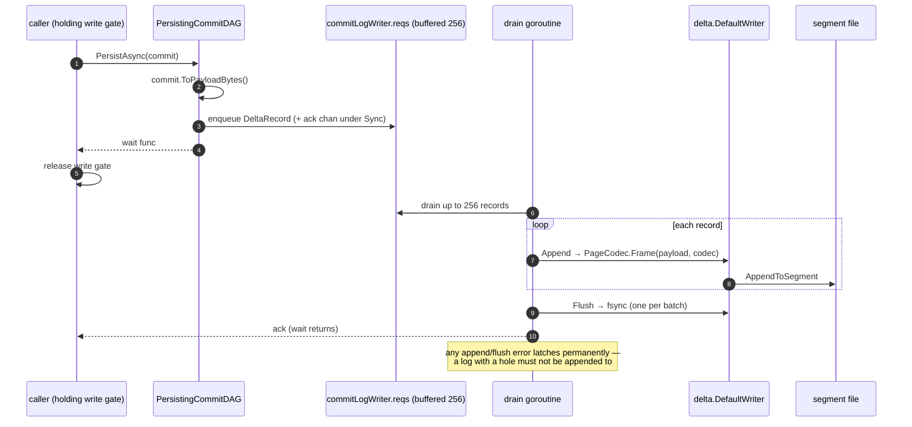

Ordering guarantee: callers enqueue **while holding the write gate**, so enqueue order is commit
order; a single drain goroutine appends in that order; delta replay depends on it.

-----

## 6. Connect, handshake, session begin

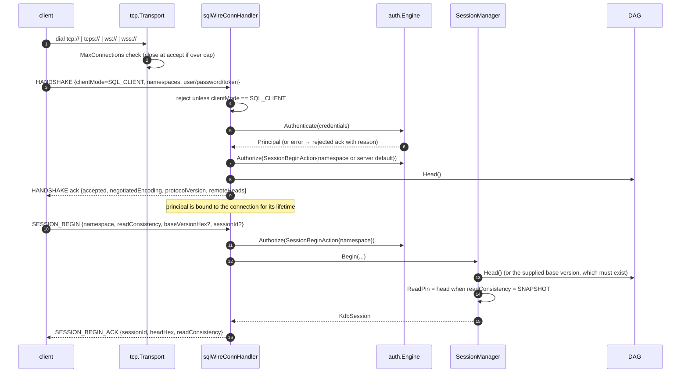

Read consistency: `SNAPSHOT` pins the session's reads to the head at session start;
`READ_COMMITTED` and `READ_YOUR_WRITES` read the live head on every statement.

-----

## 7. SQL `SELECT` over the wire

```mermaid
sequenceDiagram
    autonumber
    participant CL as client
    participant FA as FrameAdmitter
    participant H as execRead
    participant AD as Admission + CostModel
    participant SQ as sql.Engine
    participant ST as storage.Adapter
    participant D as DAG

    CL->>FA: SQL_EXEC frame (header only so far)
    FA->>FA: opClassForMessage → ClassScan; admitInZone?
    alt shed by zone
        FA-->>CL: SQL_RESULT {error, code=BUSY, retryAfterMs}  (body never read)
    end
    FA->>H: full frame
    H->>H: parse; authorize SqlExecAction{readOnly: isSelect}
    H->>H: head = session.ReadPin ?? DAG.Head()
    H->>AD: EstimateScan{shape, treeSize, maxRows, rowBudget}
    H->>AD: AcquireBytes(ClassScan, estimate)  [2s timeout]
    AD-->>H: Grant (or typed error → classified SQL_RESULT)
    H->>SQ: Execute(sql, QueryContext{ns, schema, atCommit, params, maxRows, rowBudget, stats})
    SQ->>SQ: parse → plan (full scan + limit) → execute
    SQ->>D: GetCommitOrThrow(atCommit) → DocumentTreeHash
    SQ->>ST: ScanDocuments(batch 256) / GetDocument per id
    SQ-->>H: QueryResult{columns, rows}
    H->>AD: ObserveScanActual(shape, estimate, stats.RetainedBytes + wire bytes)
    H->>AD: ObserveDocSize(namespace, mean doc bytes)
    H-->>CL: SQL_RESULT {columns, rows, resolvedCommitHex, readOnly=true}
    H->>AD: Grant.Release
```

Execution details (ordering vs. limit, aggregates, `_doc`, row budget) are in
[Part 5](kdb-lld-query.md).

-----

## 8. `INSERT` then `TX_COMMIT`

SQL writes are **buffered**, not auto-committed, on the wire path: `INSERT` accumulates document
operations on the session's pending `transaction.Builder`; `TX_COMMIT` flushes them.

```mermaid
sequenceDiagram
    autonumber
    participant CL as client
    participant H as handler
    participant SQ as sql.DMLExecutor
    participant B as session.Pending (transaction.Builder)
    participant LM as LockManager
    participant RT as KdbServerRuntime

    CL->>H: SQL_EXEC "INSERT INTO t (a,b) VALUES (?,?)"
    H->>SQ: ExecuteDML → []document.Op (fresh UUID per row, schema-validated)
    SQ-->>H: ops
    H->>B: Write(docID, patch) per op
    H-->>CL: SQL_RESULT {rowsAffected, generatedIDs, readOnly=false}

    CL->>H: TX_COMMIT {sessionId} (or transactionBytes from the SDK)
    alt transactionBytes present
        H->>H: wire.DecodeTransaction (client-built, caller-chosen doc ids)
    else
        H->>B: Build(timestamp) → document.Transaction
    end
    H->>LM: AcquireAllForTransaction(ns, sessionId, tx)   [sorted order; all-or-nothing]
    alt a document is locked by another session
        LM-->>CL: SQL_RESULT {error: document locked}
    end
    H->>RT: Commit(ns, tx, sessionId, principal)   ← flow 3
    H->>LM: ReleaseAll(sessionId)
    H->>H: ClearPending
    alt conflict
        H-->>CL: CONFLICT_REPORT {reportBytes}
    else success
        H-->>CL: SQL_RESULT {rowsAffected, resolvedCommitHex}
        Note over H: session.BaseVersion advances to the new commit
    end
```

`TX_ROLLBACK` releases the session's locks and clears the pending builder; it never touches the
DAG.

-----

## 9. Point read and upsert

```mermaid
sequenceDiagram
    autonumber
    participant CL as client
    participant H as handler
    participant AD as Admission
    participant RT as KdbServerRuntime
    participant ST as storage

    CL->>H: DOCUMENT_GET {namespace, docId}
    H->>AD: AcquireBytes(ClassPointRead, EstimatePointRead(namespace))
    Note over AD: point reads are never shed by zone policy;<br/>a cost above capacity is charged the whole capacity instead of refused
    H->>RT: GetDocument(ns, docId)
    RT->>ST: GetDocument at head tree
    H-->>CL: DOCUMENT_GET_RESULT {json, commitHex, found}

    CL->>H: UPSERT {namespace, docId, json}
    H->>RT: Upsert → UpsertEngine (ConflictPolicyLastWrite), anchored at current head
    RT-->>H: commit  (never conflicts)
    H-->>CL: UPSERT_RESULT {commitHex}
```

-----

## 10. Conflict and client retry

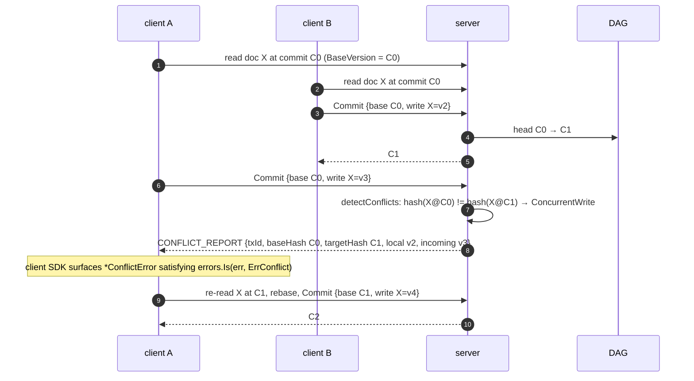

Three ways to avoid the conflict entirely, all supported: `Upsert` (last-write-wins, no base
version), `AppendEvent` (append-only namespaces, every write independent), or a `Custom`
conflict resolver configured on the engine.

-----

## 11. Crash recovery

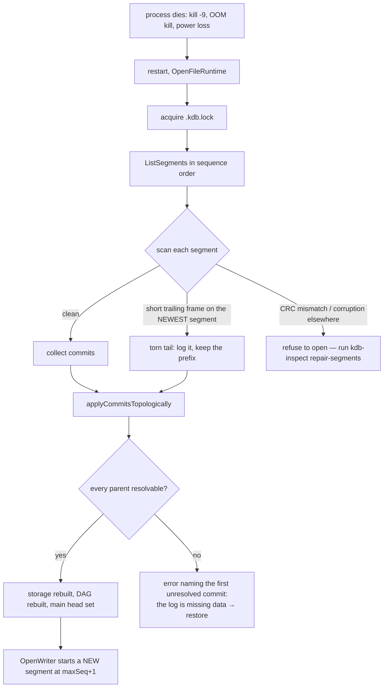

Two properties make this safe on every start: replay never trusts file order for correctness
(only for speed), and corruption is tolerated **only** where an unclean shutdown can legitimately
produce it — the tail of the most recently written segment. Anything else is reported rather than
silently truncated.

-----

## 12. Peer sync (Mode 3)

Peers are equal; either side may initiate. The decision function is shared by both directions so
the two can never disagree.

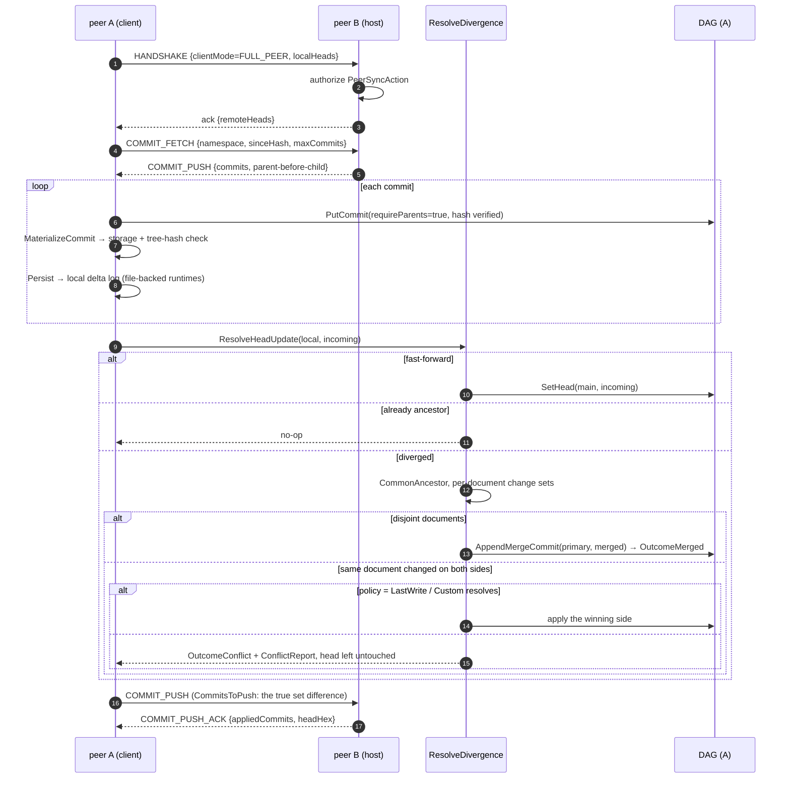

Two subtleties worth knowing:

- `CommitsToPush` computes a genuine set difference (everything reachable from the remote head is
  excluded), never a `Walk` pruned at the remote head — otherwise a merge commit's other parent
  is missed and the peer rejects the push with "missing parent".
- `ResolveDivergence` is serialized **per namespace** by a package-level lock map, because it
  reads the head, decides, and mutates across several non-atomic calls.

-----

## 13. Stream modes

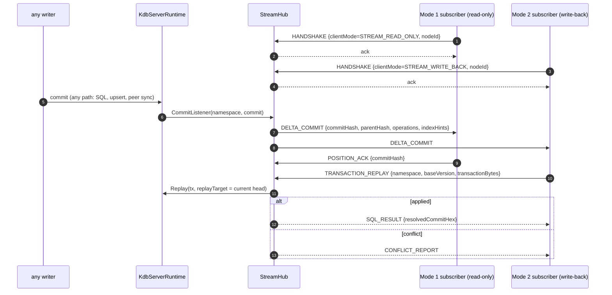

Mode 1 is a pure fan-out subscriber: it receives deltas and acknowledges positions but cannot
write. Mode 2 adds `TRANSACTION_REPLAY`, which the server applies **onto the current head** (not
onto a client-supplied target) and awaits, so the client learns the real outcome.

-----

## 14. Memory pressure and shedding

```mermaid
sequenceDiagram
    autonumber
    participant T as sampler (200 ms)
    participant G as MemoryGuard
    participant A as Admission
    participant FA as FrameAdmitter
    participant OP as an operation

    T->>G: currentMemoryUsageBytes (cgroup memory.current, else runtime/metrics)
    G->>G: push into 5-sample ring → smoothed average
    G->>G: zoneFor(smoothed, current)  [up immediately; down only after 600 ms dwell]
    G->>A: observer(smoothed, zone)
    A->>A: applyFloor: hold (smoothed − granted) bytes of the semaphore
    Note over A: this is how monotonic DAG growth becomes a throttle instead of an OOM
    alt entering Critical
        A->>A: release rescue reserve (48 MiB default, clamped to ¼ of budget)
        A->>A: debug.FreeOSMemory()
    else returning to Normal
        A->>A: re-allocate the reserve (failure is itself latched as a signal)
    end
    A->>A: scanRowBudget = base / {1,2,4,8} by zone

    OP->>FA: frame header arrives
    FA->>G: CurrentZone
    alt class not admitted in this zone
        FA-->>OP: typed rejection frame, body never read
    else
        FA->>A: Acquire(class, estimate)
        A-->>OP: Grant or BusyError / ResourceExhaustedError
    end
```

Per-zone class policy:

| Zone | entry (default) | point read | scan | write | replication |
|------|------------------|-----------|------|-------|-------------|
| Normal | < 70 % | admit | admit | admit | admit |
| Elevated | ≥ 70 % | admit | admit (½ row budget) | admit | admit |
| High | ≥ 85 % | admit | **shed** | **shed** | admit |
| Critical | ≥ 93 % | admit | shed | shed | **shed** |

-----

## 15. Orderly shutdown and abort

```mermaid
flowchart TD
    subgraph SIGTERM["SIGTERM / SIGINT"]
        A1[signal] --> A2[AdminServer.SetReady false, 'draining']
        A2 --> A3[runtime.BeginDraining → new writes get UnavailableError]
        A3 --> A4[WaitForWritesToDrain drain-timeout]
        A4 --> A5[close listeners]
        A5 --> A6[runtime.Release → EmbeddedKdbRuntime.Close]
        A6 --> A7[drain commit log → flush+seal delta segment → WAL final sync → release .kdb.lock]
        A7 --> A8[exit 0]
    end
    subgraph WATCHDOG["AbortWatchdog · sustained pressure"]
        B1[ShouldReject true for abort-after] --> B2[BeginDraining]
        B2 --> B3[close listeners]
        B3 --> B4[grace period for in-flight work]
        B4 --> B5[flush and seal storage]
        B5 --> B6[exit 75 EX_TEMPFAIL → supervisor restarts]
    end
```

Both paths converge on the same flush/seal sequence, and both are optional for correctness: the
replay path that handles `kill -9` also handles a clean exit.

-----

## 16. Verify and repair

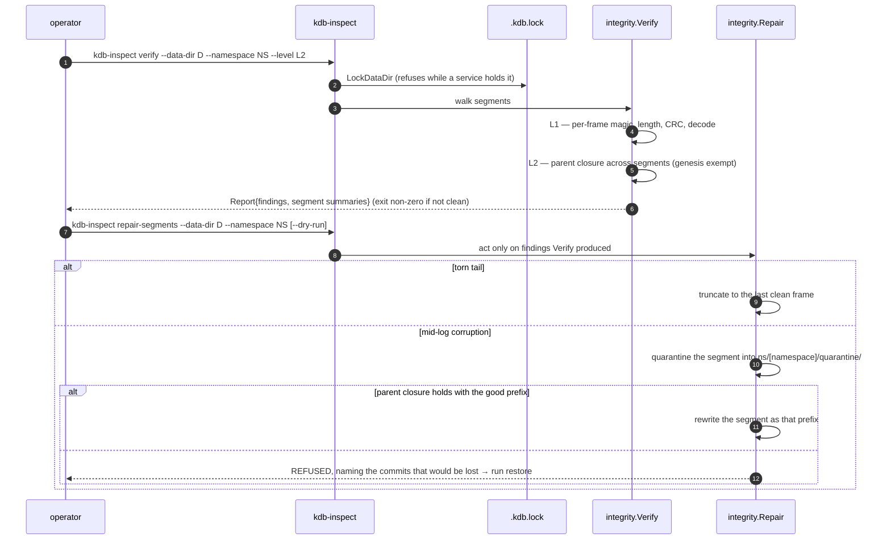

-----

## 17. Backup and restore

```mermaid
sequenceDiagram
    autonumber
    participant OP as operator
    participant B as backup.Create
    participant S as ObjectStore (DirStore | S3)
    participant RS as recovery.HybridRestore

    OP->>B: kdb-inspect backup --data-dir D --namespace NS --to DIR|s3 [--base-backup-id ID]
    B->>B: sealed segments in full (SHA-256 each)
    B->>B: active segment as its CRC-verified prefix
    B->>S: upload objects (skipping segments the base manifest already names)
    B->>S: upload manifest LAST — its presence defines the backup
    B-->>OP: Manifest{segments, tips}

    OP->>S: kdb-inspect backup-verify --backup-id ID
    S-->>OP: re-download, re-hash, report problems

    OP->>RS: kdb-inspect restore --namespace NS --out DIR --source live=/damaged --from-backup DIR --backup-id ID
    RS->>RS: union of CRC-verified commits from every source (hash-keyed)
    RS->>RS: topological order (parents first; genesis exempt)
    RS->>RS: write a fresh sequenced delta log into --out
    RS-->>OP: Result{applied, sourcesUsed, missingHashes}
```

An unverified byte is never trusted just because it is the only copy available — a commit whose
parent exists in no source is reported as missing rather than applied out of order.

-----

## 18. Schema DDL and migration

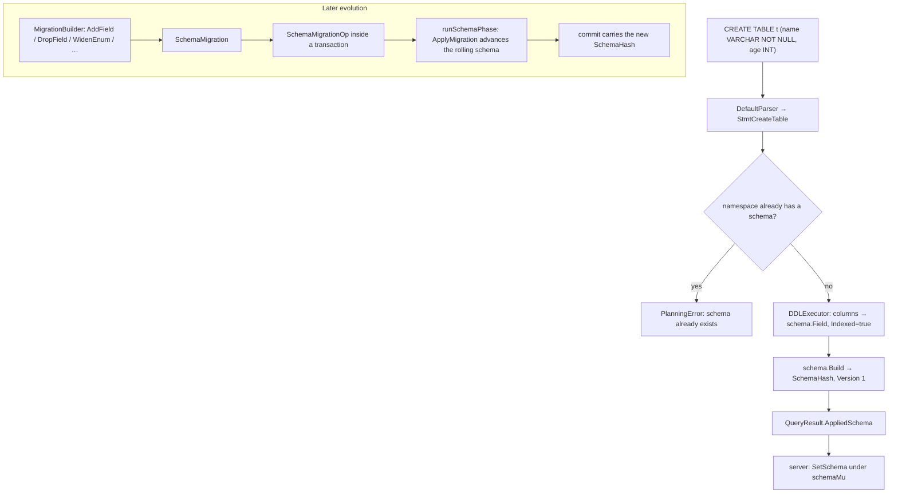

`IsBreaking(step)` classifies each step, and `DiffSchemas` reports added/removed/modified fields
with typed changes, so a caller can refuse a breaking migration before submitting it.

-----

## 19. RBAC enforcement points

Authorization is checked at **four** independent places, deliberately overlapping so no caller
path can bypass it:

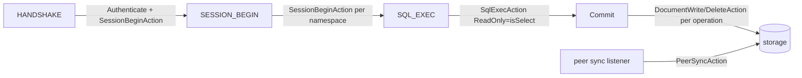

- `SqlExecAction.ReadOnly` is true **only for `SELECT`** — `CREATE TABLE` counts as a write, so a
  read-only principal cannot rewrite the namespace schema.
- `KdbServerRuntime.Commit` re-checks per operation even though the wire layer already checked,
  so a Go caller reaching the runtime directly is still enforced.
- Grants are wildcard-aware over `namespace/collection/document`; a database-level grant covers
  every collection beneath it, and a collection grant never leaks to a sibling.

-----

## Cross-references

- Types named in these flows: [Part 1 — Components](kdb-lld-components.md)
- What is safe to run concurrently: [Part 3 — Concurrency](kdb-lld-concurrency.md)
- Byte formats the flows write: [Part 4 — Storage](kdb-lld-storage.md)
- Query semantics: [Part 5 — Query](kdb-lld-query.md)
- Frames and error codes: [Part 6 — Protocol](kdb-lld-protocol.md)
