# KDB — Low-Level Design

## Part 6 · Wire Protocol, Transports, Governance, Security, Operations

**Parent:** [Part 0 — Index & architecture](kdb-lld.md) · **See also:**
[High-level architecture](kdb-architecture.md) · [Components](kdb-lld-components.md) ·
[Flows](kdb-lld-flows.md) · [Concurrency](kdb-lld-concurrency.md) ·
[Storage](kdb-lld-storage.md) · [Query](kdb-lld-query.md) · [User guide](kdb-user-guide.md)

-----

## 1. Frame format

Every KDB connection — SQL, stream, or peer sync — carries the same length-prefixed frame. The
header is **little-endian** (the only little-endian format in the system; on-disk formats are
big-endian).

```
 byte   size  field
 ----   ----  --------------------------------------------------
    0      4  frameLength   u32 LE   total, including this header
    4      2  messageType   u16 LE
    6      2  protocolVersion u16 LE
    8      4  correlationId u32 LE
   12      1  payload encoding tag   0 = kdb-binary, 1 = JSON
   13      n  payload
```

| Constant | Value |
|----------|-------|
| `FrameHeaderSize` | 12 |
| `KdbWireProtocolVersion` | 1 |
| `MinSupportedWireProtocolVersion` | 1 |
| `DefaultMaxFrameBytes` | 16 MiB |

Decoding rules (each closes a real crash or injection path):

- `frameLength` must be ≥ 12 and ≤ `maxFrameBytes`, **and** ≤ the buffer actually delivered.
  A WebSocket message arrives whole and unvalidated, and captured frames fed to `kdb-inspect` can
  be truncated, so a prefix claiming more bytes than it carries is a decode error, not a panic.
- `PayloadLength < 1` is rejected (a frame declaring an empty payload while carrying trailing
  bytes would otherwise slice `frame[13:12]`).
- An unknown `messageType` or encoding tag is a decode error.
- `PeekHeader` exists for early admission: it decodes the header from a buffer that holds *only*
  the header, returning `ok=false` (a normal outcome) when more bytes are still needed.

The current wire encoding is a **JSON envelope** (`PayloadEncoding = JSON`, tag 1); the KDB
binary encoding is negotiated-capable and used for golden-test parity.

-----

## 2. Message catalogue

| Code | Name | Direction | Purpose |
|------|------|-----------|---------|
| `0x01` | `HANDSHAKE` | ⇄ | negotiate version/encoding, authenticate, exchange heads |
| `0x02` | `DELTA_COMMIT` | server → subscriber | one commit fanned out to stream subscribers |
| `0x03` | `COMMIT_FETCH` | peer → peer | request commits since a hash |
| `0x04` | `COMMIT_PUSH` | peer → peer | send commits (parent-before-child) |
| `0x05` | `DAG_DIFF` | peer → peer | compare local/remote heads |
| `0x06` | `TRANSACTION_REPLAY` | Mode 2 client → server | submit a transaction for replay onto the head |
| `0x07` | `CONFLICT_REPORT` | server → client | structured conflict detail |
| `0x08` | `COMPACTION_NOTICE` | server → peers | an upcoming squash boundary |
| `0x09` | `ICE_ARCHIVE_NOTICE` | server → peers | a commit has been archived to ice |
| `0x0A`/`0x0B` | `SNAPSHOT_REQUEST` / `SNAPSHOT_RESPONSE` | ⇄ | bulk snapshot transfer |
| `0x0C` | `POSITION_ACK` | subscriber → server | last applied commit |
| `0x0D` | `SCHEMA_PUSH` | ⇄ | schema propagation |
| `0x0E`/`0x13` | `SESSION_BEGIN` / `SESSION_BEGIN_ACK` | client ⇄ server | open a SQL session |
| `0x0F`/`0x10` | `SQL_EXEC` / `SQL_RESULT` | client ⇄ server | execute SQL, return rows or a typed error |
| `0x11`/`0x12` | `TX_COMMIT` / `TX_ROLLBACK` | client → server | flush or discard buffered writes |
| `0x14`/`0x15` | `DOCUMENT_GET` / `DOCUMENT_GET_RESULT` | client ⇄ server | point read by document id |
| `0x16`/`0x17` | `UPSERT` / `UPSERT_RESULT` | client ⇄ server | unconditional write by document id |
| `0x18` | `COMMIT_PUSH_ACK` | peer → peer | applied count + resulting head for a non-conflicting push |

`0x14`–`0x18` are Go-side additions (Component 40 and the missing push ack): the SQL path cannot
express a read or write **at a caller-chosen document id**, because `INSERT` always mints a fresh
UUID and there is no identity predicate.

### 2.1 Key payload shapes

```go
HandshakePayload{ NodeID, Namespaces, LocalHeads map[ns]hex, Capabilities,
                  PreferredEncodings, ClientMode, ProtocolVersion,
                  User *string, Password *string, Token *string }

HandshakeAckPayload{ Accepted, NegotiatedEncoding, ProtocolVersion,
                     RemoteHeads map[ns]hex, RejectionReason *string }

SessionBeginMessage{ Namespace, SessionID *string, ReadConsistency, BaseVersionHex *string }
SessionBeginAckMessage{ Namespace, SessionID, HeadHex, ReadConsistency, Error *string }

SqlExecMessage{ Namespace, SessionID, SQL, ParametersJSON *string }
SqlResultMessage{ Namespace, SessionID, Columns []string, Rows [][]string,
                  RowsAffected, ResolvedCommitHex, ReadOnly, GeneratedIDs,
                  Error *string, ErrorCode *ErrorCode, RetryAfterMs *int }

TxCommitMessage{ Namespace, SessionID, TransactionBytes []byte }
DocumentGetMessage{ Namespace, DocID }        UpsertMessage{ Namespace, DocID, JSON }
DeltaCommitPayload{ Namespace, CommitHash, ParentHash, TimestampMicros,
                    Operations, IndexHints, SchemaDeltaBytes }
```

`ErrorCode`/`RetryAfterMs` are **additive**: an older client that reads only `Error` keeps
working, and a newer client can act on the code without parsing prose.

### 2.2 Client modes

| Mode | Value | Listener | Capability |
|------|-------|----------|------------|
| `STREAM_READ_ONLY` | 0 | `--stream-addr` | receive `DELTA_COMMIT`, send `POSITION_ACK` |
| `STREAM_WRITE_BACK` | 1 | `--stream-addr` | the above plus `TRANSACTION_REPLAY` |
| `FULL_PEER` | 2 | `--peer-addr` | `COMMIT_FETCH` / `COMMIT_PUSH` / `DAG_DIFF` |
| `SQL_CLIENT` | 3 | `--sql-addr` | sessions, SQL, document get/upsert, tx commit |

Each listener enforces its mode: the SQL listener rejects any handshake that is not
`SQL_CLIENT`.

### 2.3 Handshake negotiation

`DefaultHandshakeNegotiator.Negotiate(local, remote)`:

1. A remote protocol version above this build's, or below `MinSupportedWireProtocolVersion`, is
   rejected with `UnsupportedProtocolVersionError` (code 6001).
2. The negotiated version is `min(local, remote)`.
3. Encodings intersect in the caller's preference order; an empty list means "both"
   (`kdb-binary`, `json`). No intersection → `EncodingNegotiationFailureError` (6002).
4. The ack echoes the peer's heads so each side immediately knows whether it is behind.

-----

## 3. Transports

| Scheme | Transport | Notes |
|--------|-----------|-------|
| `tcp://host:port` | `transport/tcp` | length-prefixed frames, `TCP_NODELAY` |
| `tcps://host:port` | `transport/tcp` + TLS | explicit handshake on connect (fails fast on a bad cert) |
| `ws://` / `wss://` | `transport/ws` | one frame per WebSocket message; carries HTTP headers, which the JVM server uses as an auth side channel |
| in-memory hub | `stream.InMemoryTransport` | tests, browser demo, single-process wiring |

Listener behaviour:

- `ListenBound(uri)` binds synchronously so a caller can read back the port when it asked for
  `:0`; `Serve(ctx, ln, handler)` runs the accept loop.
- `MaxConnections` is enforced **at accept time** — over the cap, the connection is closed
  immediately, because a connection never established costs nothing to refuse.
- A `tcps://`/`wss://` URI with no usable TLS settings is a hard error. There is no silent
  downgrade to plaintext, in either direction.
- `?bind=true` in a listen URI marks it as a bind address rather than a dial target.

-----

## 4. Sessions

```mermaid
stateDiagram-v2
    [*] --> Connected: TCP/TLS/WS established
    Connected --> Authenticated: HANDSHAKE accepted
    Connected --> [*]: HANDSHAKE rejected (rejectionReason)
    Authenticated --> SessionOpen: SESSION_BEGIN_ACK with sessionId
    SessionOpen --> SessionOpen: SQL_EXEC (SELECT executes; INSERT buffers)
    SessionOpen --> SessionOpen: DOCUMENT_GET / UPSERT
    SessionOpen --> Committing: TX_COMMIT
    Committing --> SessionOpen: SQL_RESULT (base version advances)
    Committing --> SessionOpen: CONFLICT_REPORT (nothing written)
    SessionOpen --> SessionOpen: TX_ROLLBACK (locks released, buffer cleared)
    SessionOpen --> [*]: disconnect (all document locks released)
```



| Property | Rule |
|----------|------|
| Authentication | once per **connection**, at handshake; the principal is bound for the connection's life (TCP has no per-request auth side channel) |
| Authorization | at handshake, at every `SESSION_BEGIN`, at every `SQL_EXEC`, and per operation at commit |
| Session id | client-supplied or server-generated (`sess-N`) |
| Read consistency | `SNAPSHOT` pins `ReadPin` at begin; `READ_COMMITTED` / `READ_YOUR_WRITES` read the live head |
| Base version | the session's anchor for buffered writes; advances on each successful commit |
| Document locks | held by session id from `TX_COMMIT`'s acquire until commit completes; also released on rollback and on disconnect |

-----

## 5. Resource governance

The full policy (Layer 13 Components 47–52). One sentence: **start only what we can finish.**

### 5.1 Pressure zones

| Zone | Default entry (fraction of budget) | Leaves at | Behaviour |
|------|-----------------------------------|-----------|-----------|
| Normal | — | — | admit everything |
| Elevated | 70 % | 63 % | admit everything; scan row budget ÷2 |
| High | 85 % | 76.5 % | shed scans and writes; admit point reads and replication; row budget ÷4 |
| Critical | 93 % | 83.7 % | admit point reads only; drop the rescue reserve; `FreeOSMemory`; start the abort timer; row budget ÷8 |

Thresholds are derived from a single operator knob (`rejectFraction`, the entry point of High,
default 0.85) so the four zones can never be configured into a nonsensical order. Hysteresis:
entry thresholds move **up** immediately, exit requires falling below `0.9 ×` the entry level
**and** holding for a 600 ms dwell (three samples at the 200 ms poll).

### 5.2 What is measured

`currentMemoryUsageBytes()` prefers the Linux **cgroup `memory.current`** — the exact figure a
container's `--memory` limit is enforced against — and falls back to
`/memory/classes/total:bytes − /memory/classes/heap/released:bytes` via `runtime/metrics`.

Two earlier mistakes this replaced, both worth remembering:
`MemStats.Sys` never decreases (a tripped guard stayed tripped for the life of the process), and
`runtime.ReadMemStats` stops the world every 200 ms — a self-inflicted latency source in exactly
the conditions the guard exists for.

### 5.3 Grants

```
capacity   = budget − rescueReserve
usable     = capacity − floorHeld
floorHeld  = clamp(smoothedUsage − outstandingGrants, 0, capacity − 1 MiB)
estimate   = CostModel.Estimate(class, payload) | EstimateScan(shape…) | EstimatePointRead(ns)
```

| Class | Estimated from | Shed at |
|-------|----------------|---------|
| `ClassPointRead` | observed document size × 0.5 + 4 KiB base | never |
| `ClassScan` | namespace cardinality × observed doc size × plan shape, or the learned p95 | High |
| `ClassWrite` | 8 KiB + 1.5 × payload bytes (measured calibration, biased high) | High |
| `ClassReplication` | same as write | Critical |

A point read whose estimate exceeds the whole capacity is charged the entire capacity rather than
refused — a read has no smaller form, and a node that cannot answer point reads is
indistinguishable from one that is down. Any other class over capacity gets
`RESOURCE_EXHAUSTED` ("resubmit smaller"), which is deliberately *not* `BUSY` ("retry later"),
because waiting cannot help.

### 5.4 Early admission

The `FrameAdmitter` classifies a message **from its 12-byte header** and sheds before the body is
read, assembled, or decoded:

| Message | Class |
|---------|-------|
| `DOCUMENT_GET` | point read |
| `SQL_EXEC` | scan (an INSERT cannot be distinguished without decoding — and both classes are shed in the same zones, so it makes no practical difference) |
| `TX_COMMIT`, `UPSERT`, `TRANSACTION_REPLAY` | write |
| `COMMIT_PUSH`, `DELTA_COMMIT` | replication |
| handshake, session begin, rollback, everything else | never shed |

A frame is only shed if a typed reply can be built for it; otherwise it is admitted and left to
the normal path, because a dropped request with no reply is the "connection just stops
responding" failure this design exists to eliminate.

### 5.5 Rescue reserve

`--memory-reserve-mb` (default 48 MiB, **clamped to ¼ of the budget**) is a real allocation with
one byte touched per 4 KiB page — a reservation the allocator has not honoured is an intention,
not headroom. It is released on entry to Critical so the abort sequence has room to finish
in-flight commits, flush the log, and write typed rejections. Failing to re-allocate it on the way
back to Normal is itself latched as a signal (`ReserveLost`).

-----

## 6. Error taxonomy

### 6.1 Wire codes

| `ErrorCode` | Meaning | Client action |
|-------------|---------|---------------|
| `BUSY` | queue full, grant capacity unavailable, or memory pressure | retry after `RetryAfterMs` |
| `UNAVAILABLE` | the server is draining/shutting down | reconnect, likely to a restarted instance |
| `DEADLINE_EXCEEDED` | the caller's own deadline passed while queued | retry with a longer deadline |
| `RESOURCE_EXHAUSTED` | this operation can never be admitted as written (too large, or scan budget exceeded) | resubmit smaller / narrow the query |
| `CONFLICT` | optimistic-concurrency conflict | rebase on the new head and retry |
| `SCHEMA_VIOLATION` | the transaction is invalid | never retry unmodified |
| `UNAUTHORIZED` | RBAC denial | never retry unmodified |
| `INTERNAL` | unclassified | investigate |

Mapping from internal errors (`classifyError`): `BusyError`/`MemoryPressureError` → `BUSY`
(with a retry-after derived from the zone), `UnavailableError` → `UNAVAILABLE`,
`DeadlineExceededError` → `DEADLINE_EXCEEDED`, `ResourceExhaustedError` and
`sql.ScanRowBudgetExceededError` → `RESOURCE_EXHAUSTED`, `AuthorizationError` → `UNAUTHORIZED`,
`SchemaError` → `SCHEMA_VIOLATION`, everything else → `INTERNAL`.

### 6.2 Client SDK sentinels

```go
errors.Is(err, client.ErrConflict)          // + errors.As → *ConflictError with per-document detail
errors.Is(err, client.ErrBusy)              // + *BusyError.RetryAfter()
errors.Is(err, client.ErrUnavailable)
errors.Is(err, client.ErrDeadlineExceeded)
errors.Is(err, client.ErrNotFound)          // GetJSON
errors.Is(err, client.ErrUnauthenticated)   // Connect
errors.Is(err, client.ErrClosed)
```

### 6.3 Engine error codes (numeric, stable)

| Code | Name | Raised by |
|------|------|-----------|
| 1001 / 1002 | decode / encode error | codec |
| 1005 | schema error | codec-schema |
| 2001 | JSONPath error | json |
| 3001 / 3002 | schema violation / migration failed | schema |
| 3101 | version not found | dag |
| 3102 | ice storage (commit archived) | dag stubs |
| 3103 | compaction boundary | compaction |
| 4001 / 4002 | conflict / document locked | transaction |
| 4101 / 4102 | storage tier error / data directory locked | storage, embed |
| 4201 | namespace not found | storage |
| 5001 | index corruption | index |
| 6001 / 6002 | unsupported protocol version / encoding negotiation failure | wire |
| 6101 | transport error | transport |
| 6201 / 6202 | compute unavailable / dispatch error | compute |
| 6301 / 6302 | authentication / authorization failed | auth |
| 7001 | archive restore | tier |

-----

## 7. Security

### 7.1 Authentication

| Mechanism | Where |
|-----------|-------|
| user + password | `HANDSHAKE` payload (`User`, `Password`) |
| combined token `"user:secret"` | `HANDSHAKE` payload (`Token`), also what `client.Connect(ctx, addr, token)` sends |
| HTTP headers | WebSocket transport on the JVM (`ConnectionContext` from headers) |
| none | `auth.AllowAll` — the default when `--rbac` is not set |

Passwords are stored as **PBKDF2-HMAC-SHA256** with a per-user random salt; the Go and Kotlin
implementations are cross-verified against a shared golden vector, so a registry written by one
runtime authenticates under the other.

### 7.2 Authorization

Grants are strings of the form `<kind>:<pattern>`, matched against a `ResourcePath` of
`namespace / collection / document`. A trailing `/*` is a prefix wildcard that also matches the
prefix itself.

| Grant | Covers |
|-------|--------|
| `read:myapp/*` | every collection and document under `myapp` |
| `write:myapp/users` | that collection and every document in it |
| `write:myapp/users/<docId>` | exactly that document |

Kinds, and the action each one gates (`actionToResource`):

| Kind | Actions |
|------|---------|
| `read` | `SessionBeginAction`, `SqlExecAction{ReadOnly: true}`, `DocumentReadAction` |
| `write` | `SqlExecAction{ReadOnly: false}`, `TxCommitAction`, `DocumentWriteAction`, `DocumentDeleteAction` |
| `sync` | `PeerSyncAction` |
| `admin` | `AdminAction` — the RBAC admin surface (create/drop user and role, grant/revoke) |

Matching walks from most specific to least specific: document → collection → database.

Rules verified by tests: a database-level grant covers every collection and document beneath it;
a collection grant never leaks to a sibling collection; a document grant never leaks to a sibling
document.

Enforcement points (all four, deliberately overlapping): handshake, session begin, `SQL_EXEC`
(`ReadOnly` only for `SELECT`), per-operation at commit, and `PeerSyncAction` on the peer
listener.

The user/role registry lives in the reserved namespaces `_system/users` and `_system/roles`, with
every mutation a commit — so RBAC state is versioned, replayable, and backed up like any other
data. With `--data-dir` it is durable; without it the registry is in memory and vanishes on
restart.

### 7.3 Transport security

| Flag | Effect |
|------|--------|
| `--tls-cert` + `--tls-key` | every listener's scheme is upgraded `tcp://` → `tcps://` |
| `--tls-ca` | CA bundle used to verify client certificates |
| `--tls-client-auth` | require and verify a client certificate (mTLS); requires `--tls-ca` |

Client side: `ConnectWithOptions(ctx, addr, token, ConnectOptions{TLS: &core.TransportTlsSettings{…}})`.
`InsecureSkipVerify` exists for test harnesses and must not be used in production.

### 7.4 Security properties and non-goals

| Property | Status |
|----------|--------|
| Encryption in transit | TLS/mTLS on every listener |
| Encryption at rest | **not implemented** — Layer 14 is specified only ([spec](kdb-spec-layer14-encryption-at-rest.md)); the memory note records it as a whole-store or per-collection toggle |
| Admin endpoint auth | **none** — bind `--admin-addr` to localhost or a private interface |
| Password storage | PBKDF2-HMAC-SHA256 + per-user salt |
| Commit authenticity | content-addressed and hash-verified on ingest; **not signed** — there is no cryptographic author identity yet |
| Multi-tenant isolation | namespace-scoped RBAC; one process serves one namespace |

-----

## 8. Observability

### 8.1 Admin HTTP surface (`--admin-addr`)

| Endpoint | Response |
|----------|----------|
| `GET /healthz` | `ok` plus `version=`, `commit=`, `commit_dirty=`, `build_date=` |
| `GET /readyz` | `ready`, or 503 with `not ready: starting` \| `not ready: draining` |
| `GET /metrics` | Prometheus text exposition (below) |
| `GET /debug/vars` | expvar JSON |
| `GET /debug/pprof/…` | profiles (`profile`, `trace`, `cmdline`, `symbol`) |

### 8.2 Metrics

| Metric | Type | Labels |
|--------|------|--------|
| `kdb_build_info` | gauge (always 1) | version, commit, dirty, build_date, go_version |
| `kdb_stage_ops_total` | counter | stage (`lock_wait`, `fsync_wait`, `tree_rebuild`) |
| `kdb_stage_latency_seconds` | gauge | stage, stat (`mean`, `p50`, `p99`, `max`) |
| `kdb_go_goroutines`, `kdb_go_heap_alloc_bytes`, `kdb_go_mem_total_bytes`, `kdb_go_gc_total` | gauges/counter | — |
| `kdb_draining` | gauge | — |
| `kdb_memory_zone` | gauge | 0 normal … 3 critical |
| `kdb_admission_granted_total` | counter | class |
| `kdb_admission_denied_total` | counter | class, reason (`zone`, `capacity`, `too_large`) |
| `kdb_admission_outstanding_bytes`, `kdb_admission_floor_bytes`, `kdb_admission_scan_row_budget` | gauges | — |
| `kdb_admission_zone_changes_total`, `kdb_admission_critical_enters_total` | counters | — |
| `kdb_cost_estimate_accuracy_p95`, `kdb_cost_safety_multiplier` | gauges | class |
| `kdb_cost_learned_cells` | gauge | — |

A shedding server that cannot be observed shedding is indistinguishable from a broken one —
hence `kdb_admission_denied_total` broken out by reason, and `kdb_memory_zone` as a first-class
gauge.

### 8.3 Logging

Structured (`log/slog`), `--log-level debug|info|warn|error`, `--log-format text|json`. The
startup line carries the full build identity plus the resolved status of every subsystem (SQL,
peer, stream, admin, TLS, RBAC, memory budget, abort watchdog).

-----

## 9. Configuration resolution

`kdb-service` merges four sources in ascending precedence:

```
defaults  <  --config file (JSON)  <  KDB_* environment  <  explicitly-set flags
```

`ServiceFile` uses pointer fields to distinguish "absent" from a real zero value, and **rejects
unknown fields** so a typo fails loudly at startup instead of silently configuring nothing.
Complete flag reference: [User guide](kdb-user-guide.md).

-----

## 10. Compatibility and versioning

| Surface | Rule |
|---------|------|
| Wire protocol version | `1`; a peer outside `[Min, Current]` is rejected at handshake |
| Message additions | new types are additive; unknown types are a decode error, so a new client must not send them to an old server |
| Field additions | additive and optional (`ErrorCode`, `RetryAfterMs`, `SessionBeginAck.Error`) — an old reader ignores them |
| Delta frame format | v2; the codec is recorded per frame, so compression settings may change freely |
| SSTable block format | v2; a v1 block is rejected with a clear error rather than mis-decoded |
| Segment naming | pre-Layer-13 names are refused with a repair instruction, never guessed at |
| Error codes | numeric values never change once published |
| Cross-language | Go and Kotlin must produce identical bytes for wire frames, the codec, SSTable/delta formats, and password hashes; format changes originate on the Kotlin side ([go-porting.md](go-porting.md)) |

-----

## Cross-references

- The frames in motion: [Part 2 — Flows](kdb-lld-flows.md)
- Bounded queues behind the typed refusals: [Part 3 §8](kdb-lld-concurrency.md)
- What the bytes land in: [Part 4 — Storage](kdb-lld-storage.md)
- What `SQL_EXEC` may carry: [Part 5 — Query](kdb-lld-query.md)
- Running and operating a server: [User guide](kdb-user-guide.md)
