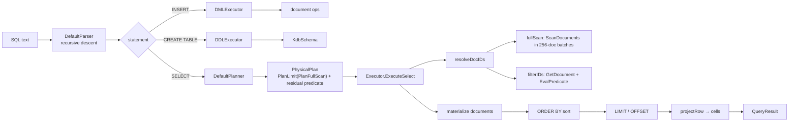
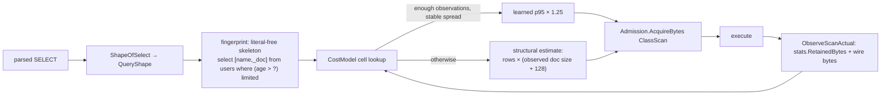
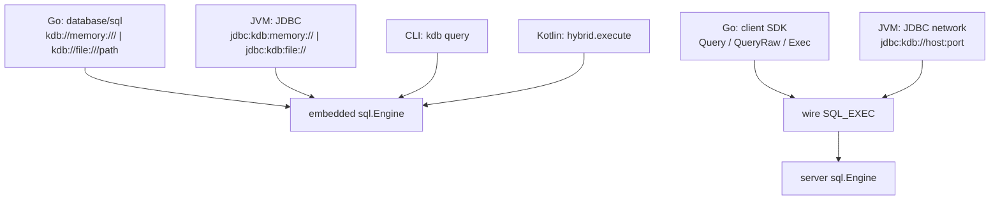

# KDB — Low-Level Design

## Part 5 · Query Engine and KDB-SQL

**Parent:** [Part 0 — Index & architecture](kdb-lld.md) · **See also:**
[High-level architecture](kdb-architecture.md) · [Components](kdb-lld-components.md) ·
[Flows](kdb-lld-flows.md) · [Concurrency](kdb-lld-concurrency.md) ·
[Storage](kdb-lld-storage.md) · [Protocol](kdb-lld-protocol.md) ·
[User guide](kdb-user-guide.md)

> **Naming.** KDB's query language is **KDB-SQL**. There is no separate "CQL" — this document is
> the complete reference for the language, its execution model, and its limits.

-----

## 1. The model: document truth, schema lens

```
You store whole JSON documents.          → the document is the truth
You get whole JSON documents back.       → _doc always returns it, byte for byte
Schema declares what SQL can see.        → typed, indexable projections of the same JSON
Schema never constrains the document.    → extra fields are stored and returned untouched
```

Every namespace behaves as one table with a fixed column shape:

| Column | Source | Type |
|--------|--------|------|
| `kdb_id` | the document UUID | `VARCHAR` |
| *one column per declared schema field* | `$.<fieldName>` in the document JSON | the field's `SQLTypeName()` |
| `_doc` | the entire document JSON | `JSON` |

A schema field column is exactly `kdb_json_get(_doc, '$.field')` with an index on top. Reading
`_doc` and schema columns in the same query is not just allowed — it is the intended usage.

```sql
SELECT kdb_id, name, _doc FROM users WHERE age > 30 ORDER BY name LIMIT 20;
```

-----

## 2. Language reference (Go implementation)

The Go parser ([`go/kdb/sql/parser.go`](../go/kdb/sql/parser.go)) is a hand-written
recursive-descent parser. This grammar is exact — anything not listed is a parse error.

```ebnf
statement      = select | insert | createTable ;

select         = "SELECT" [ "DISTINCT" ] projections
                 "FROM" identifier
                 [ "WHERE" expr ]
                 [ "ORDER" "BY" orderItem { "," orderItem } ]
                 [ "LIMIT" integer ]
                 [ "OFFSET" integer ] ;

projections    = projection { "," projection } ;
projection     = "*"
               | "COUNT" "(" ( "*" | expr ) ")" [ "AS" identifier ]
               | identifier [ "AS" identifier ] ;

orderItem      = expr [ "ASC" | "DESC" ] ;

insert         = "INSERT" "INTO" identifier "(" identifier { "," identifier } ")"
                 "VALUES" row { "," row } ;
row            = "(" expr { "," expr } ")" ;

createTable    = "CREATE" "TABLE" identifier "(" columnDef { "," columnDef } ")" ;
columnDef      = identifier columnType [ "NOT" "NULL" ] ;
columnType     = ( "VARCHAR" | "TEXT" | "STRING" | "CHAR" ) [ "(" integer ")" ]
               | ( "INT" | "INTEGER" ) | ( "BIGINT" | "LONG" )
               | ( "DOUBLE" | "FLOAT" | "REAL" ) | ( "BOOLEAN" | "BOOL" )
               | ( "TIMESTAMP" | "DATETIME" ) | "UUID" ;

expr           = orExpr ;
orExpr         = andExpr { "OR" andExpr } ;
andExpr        = comparison { "AND" comparison } ;
comparison     = "NOT" comparison
               | primary [ "IS" [ "NOT" ] "NULL" ]
               | primary [ ( "=" | "<>" | "!=" | "<=" | ">=" | "<" | ">" ) primary ] ;
primary        = stringLiteral | number | "NULL" | "?" 
               | identifier [ "(" [ expr { "," expr } ] ")" ]
               | "(" expr ")" ;
```

Lexical rules:

| Element | Rule |
|---------|------|
| identifier | `[A-Za-z_][A-Za-z0-9_]*`, case-sensitive when matched against schema fields |
| keyword | case-insensitive |
| string literal | single-quoted; `''` escapes a quote |
| number | digits with an optional `.`; a `.` makes it a double |
| parameter | `?`, positionally indexed in parse order |
| `NULL` | literal null |
| comments, semicolons | not supported — send one statement, no trailing `;` |

### 2.1 Pseudo-columns

| Name | Meaning |
|------|---------|
| `kdb_id` | the document UUID as a string; usable in projections and predicates |
| `_doc` | the whole document JSON; a `CellJSON` in results |

`SELECT *` expands to `kdb_id`, then every schema field in declaration order, then `_doc`.

### 2.2 Aggregates

`COUNT(*)` and `COUNT(expr)` are implemented. `SUM`, `AVG`, `MIN`, `MAX` are recognised as
aggregate *names* by `isAggregateFunction`, but the Go projection parser only special-cases
`COUNT`, and `EvalAggregate` returns `NULL` for the others — so use `COUNT` only in the Go
implementation today (the Kotlin engine is broader, see §8).

`COUNT` semantics:

| Form | Counts |
|------|--------|
| `COUNT(*)` | all matching rows |
| `COUNT(col)` | rows where `col` evaluates to a non-null cell |

An aggregate query strips the plan's `LIMIT` before scanning: `LIMIT` bounds the *output* of an
aggregate (which is one row), never its input.

### 2.3 Predicate evaluation

Predicates are evaluated **per document, in Go**, against the document's JSON:

```
CellForColumn(name, doc, schema):
    "kdb_id"  → CellString(doc.ID)
    "_doc"    → CellJSON(doc.JSON)
    schema field → json.GetString(doc.JSON, "$." + name) → typed cell
    unknown   → CellNull
```

| JSON value | Cell |
|------------|------|
| string | `CellString` |
| integer | `CellLong` |
| number | `CellDouble` |
| bool | `CellLong` (0/1) |
| null / missing / non-scalar | `CellNull` |

Comparison uses `CompareCells`, whose ordering rules are:

- `NULL` sorts **before** everything, and `NULL` compares *equal* to `NULL` (so `x = NULL` is
  true when both sides are null — this is not SQL's three-valued logic; use `IS NULL` for
  standard behaviour).
- Same-kind comparisons are natural (`strings.Compare`, numeric `<`/`>`).
- **Mixed-kind comparisons return 0** (treated as equal) rather than coercing. Compare a string
  column to a string literal and a numeric column to a numeric literal.

`IS NULL` / `IS NOT NULL` test for a null-or-absent cell explicitly and are the reliable way to
express nullability predicates.

### 2.4 Parameters

`?` placeholders are bound positionally from `QueryContext.Parameters`
(`ParamString`, `ParamInt`, `ParamDouble`, `ParamBool` → 0/1, `ParamNull`). An out-of-range index
yields `CellNull` rather than an error. Over the wire, parameters travel as JSON in
`SQL_EXEC.parametersJson`; through `database/sql` and JDBC they come from the driver's normal
argument binding.

### 2.5 INSERT

```sql
INSERT INTO users (name, age) VALUES ('Ada', 36), ('Grace', 45);
```

- Each row mints a **fresh random UUID** — `INSERT` cannot target a caller-chosen document id.
  Use `client.PutJSON` / `Upsert` / `PutIfAbsent` (or the embedded API) for that.
- A `unique`-declared field is enforced at commit: a colliding row fails with `UNIQUE_VIOLATION`
  naming the field and the document that already holds the value (see §2.8).
- Column values are written into an empty JSON object via JSONPath `$.<column>`, so an INSERT
  produces a document containing exactly the named columns.
- The resulting document is schema-validated before the operation is produced; a violation is a
  `PlanningError` carrying the first field violation.
- The wire path **buffers** the resulting operations on the session's pending transaction — see
  [Part 2 §8](kdb-lld-flows.md). `client.Exec` auto-commits so that one call is one unit of work.

### 2.6 CREATE TABLE

```sql
CREATE TABLE users (name VARCHAR NOT NULL, age INT, email VARCHAR);
```

- Builds a `KdbSchema` with `Version = 1`; every column is `Indexed = true`, `NOT NULL` maps to
  `Required`.
- Applied through `SetSchemaChecked`: if the new schema declares a `unique` field that the data
  already violates, the migration is **rejected and rolled back** rather than left permanently at
  odds with its own namespace.
- Fails if the namespace already has a schema (there is no `ALTER TABLE` in the Go parser; schema
  evolution goes through `schema.MigrationBuilder`).
- On the server the applied schema is stored under the runtime's schema lock and takes effect for
  subsequent statements on every connection.
- `CREATE TABLE` is **not** a read: `SqlExecAction.ReadOnly` is false for it, so a read-only
  principal cannot use it to rewrite the namespace schema.

### 2.7 Unique constraints and conditional writes

`unique` on a schema field is enforced by the commit path, not by SQL. `SELECT` is unaffected;
every write — `INSERT`, `Upsert`, `Commit`, `PutIfAbsent` — is checked against a registry of
`(namespace, field, value) → docID` inside the write gate:

| Situation | Result |
|-----------|--------|
| the value is free | claimed |
| this document already holds it | allowed (rewriting without changing the field) |
| the holder releases it in the same transaction | allowed (a swap, or delete-then-recreate) |
| two operations in one transaction claim it | violation — atomicity is not a laundering mechanism |
| another document holds it | `UNIQUE_VIOLATION`, naming the owner |

Absent and JSON-null values claim nothing (SQL semantics — an optional unique field would
otherwise admit exactly one document that omits it). Values canonicalise through `encoding/json`,
so `1` and `1.0` collide; strings compare byte-wise, so case-insensitive uniqueness is something a
schema must express rather than something the engine assumes.

**Conditional writes are not SQL.** There is no `INSERT … ON CONFLICT` and no `UPDATE … WHERE
version = ?`; compare-and-set lives on the client API (`PutIfAbsent`, `ReplaceIf`,
`ReplaceIfPresent`, `CompareAndSwap`), because a precondition is an assertion about a document's
identity of state, which the SQL surface has no way to name. See
[Part 2 §21](kdb-lld-flows.md#21-compare-and-set-and-insert-if-absent).

### 2.8 Versioned reads (the hybrid layer)

`query/hybrid` accepts a trailing version clause and strips it before the base parser runs:

```sql
SELECT * FROM users AT VERSION 'v1.2';        -- resolve a tag
SELECT * FROM users AT COMMIT '9f3c…';        -- resolve an exact commit hash
SELECT * FROM users AT TIME '2026-08-01T00:00:00Z';  -- newest commit at or before the instant
```

Resolution order in `hybrid.Engine.Execute`: an explicit clause wins; otherwise an active
per-namespace **checkout** (`Checkout(namespace, CommitRef)`) is used; otherwise the DAG head.
The resolved hash becomes `QueryContext.AtCommit` and is echoed back to the client as
`resolvedCommitHex`.

Session-level equivalents on the wire: `SESSION_BEGIN` with `readConsistency = SNAPSHOT` pins the
session to the head at session start; `baseVersionHex` pins it to an explicit commit.

-----

## 3. Execution pipeline



### 3.1 Planning

`DefaultPlanner.PlanSelect` is intentionally minimal:

1. Validate every `ProjColumn` name against `kdb_id`, `_doc`, or a declared schema field.
   An unknown column is a `PlanningError` **returned, never panicked** — the planner runs in the
   connection goroutine, and a panic there would take down every other connection.
2. Emit `PlanLimit{Limit, Offset, Input: PlanFullScan}`.
3. Return the `WHERE` expression unchanged as the **residual predicate**.

There is no index selection in the Go planner today: every SELECT is a full scan plus a residual
filter. The index layer (`index.VersionedEngine` and the Kotlin composite index factory) exists
and is versioned, but the Go planner does not yet consult it. This is the single largest known
gap between the Go query engine and the specification.

### 3.2 Execution order

The executor deliberately reorders the plan in two cases, because the naive order is wrong:

| Case | Naive result | What the executor does |
|------|--------------|------------------------|
| `ORDER BY` + `LIMIT` | limit applied during id resolution → "three arbitrary rows, sorted among themselves" | strip the `PlanLimit`, resolve ids, materialize, sort, **then** apply limit/offset |
| aggregate + `LIMIT` | `SELECT COUNT(*) … LIMIT 1` answers `1` | strip the `PlanLimit` entirely; limit bounds the single output row |

### 3.3 Scan bounds

Two independent caps, and the distinction matters:

| Bound | Field | Meaning | Exceeded → |
|-------|-------|---------|-----------|
| `MaxRows` | `QueryContext.MaxRows` (wire default 10 000) | rows **returned** | scan stops early (sentinel `errScanComplete`, which unwinds `ScanDocuments` immediately rather than merely ending a batch) |
| `RowBudget` | `QueryContext.RowBudget` (default 1 000 000, halved per pressure zone) | rows **examined** | `ScanRowBudgetExceededError` → wire `RESOURCE_EXHAUSTED` |

A selective `WHERE` over ten million documents returns almost nothing while still reading all ten
million to decide that. `MaxRows` bounds what the client sees; only `RowBudget` bounds what the
server spends.

### 3.4 Measurement — `ExecStats`

The executor fills `QueryContext.Stats` as it runs:

| Counter | Incremented at |
|---------|----------------|
| `RowsExamined` | every scanned or filtered row |
| `DocsRead`, `DocBytesRead` | every document fetch, including transient predicate reads |
| `RetainedBytes` | every materialized document (`len(JSON) + 128` overhead) and every projected row's cells (`content + 32` per cell) |

These are exact and attributable to one query even under concurrency, which is why the cost model
learns from them rather than from process-wide allocation counters.

-----

## 4. Query shapes and the cost model

Before a `SELECT` runs, the server estimates the memory it will retain and reserves it.



`QueryShape` records what actually predicts cost:

| Field | Effect on cost |
|-------|----------------|
| `Fingerprint` | the map key: projections, table, predicate skeleton (literals → `?`), order-by, "limited" presence |
| `HasOrderBy` | every matching row is materialized before sorting — `LIMIT` cannot cap retained memory |
| `HasAggregate` | every matching row is aggregate input; `LIMIT` bounds the one output row |
| `ProjStar` | per-row cost ≈ whole document size |
| `HasPredicate` | rows examined can far exceed rows retained |
| `Limit` | presence only; the numeric difference is handled by the row-count term |

Learning safeguards: a cell needs **8 observations** before it may override the structural
estimate; a cell whose observed max/min spread exceeds **64×** is treated as unreliable (the
classic parameter-sensitivity failure, where one fingerprint covers both a `LIMIT 5` lookup and a
full-namespace pull) and falls back to the structural model; learned values carry a **1.25×**
headroom, because under-estimation is the dangerous direction. State is bounded (≤ 256
namespaces × ≤ 512 shapes × 64 samples, FIFO-evicted) and can be persisted between restarts
(`costmodel.json` under the data directory, treated as a discounted prior and silently ignored if malformed).

-----

## 5. Result shape

```go
type QueryResult struct {
    Columns       []ResultColumn   // {Name, SQLType, Source}
    Rows          []QueryRow       // Values []Cell
    RowsAffected  int
    GeneratedIDs  []string
    AppliedSchema *schema.KdbSchema  // set by CREATE TABLE
}
```

`ColumnSource` distinguishes `SchemaField`, `KdbID`, `DocJSON`, and `Expression`, which is what
lets JDBC metadata and the client SDK's row decoder tell a schema column from `_doc`.

Over the wire, rows are flattened to `[][]string` (`SQL_RESULT.rows`); `client.Query` reflects
them back into a caller struct by case-insensitive column name, and `client.QueryRaw` returns
them as-is for columns like `_doc` that have no natural struct field name.

-----

## 6. Access paths — how each caller reaches the engine



| Surface | Statements supported | Transaction model |
|---------|---------------------|-------------------|
| Go `database/sql` (embedded) | SELECT, INSERT, CREATE TABLE | statement-scoped; `Begin()` is a thin wrapper |
| Go client SDK (`Exec`) | SELECT, INSERT, CREATE TABLE | `Exec` auto-commits an INSERT as one unit |
| Go wire session | SELECT immediate; INSERT buffered | explicit `TX_COMMIT` / `TX_ROLLBACK` |
| JDBC embedded (Kotlin) | full Kotlin grammar (§8) | auto-commit per statement |
| JDBC network (Kotlin) | full Kotlin grammar | `BEGIN` … `COMMIT` multi-statement transactions |

-----

## 7. Semantics, limits, and gotchas

Documented precisely because each of these will surprise someone:

| # | Behaviour | Detail |
|---|-----------|--------|
| 1 | **`FROM` is not resolved against a catalog** | the table name is parsed and validated syntactically; rows always come from the connection's namespace |
| 2 | **`DISTINCT` is parsed but not applied** in the Go executor | it participates in the query shape fingerprint only |
| 3 | **Historical reads return current documents** | `AtCommit` selects the commit whose tree hash is used, but `ServerEngine.GetDocument` ignores the tree hash and returns current committed state; full historical materialization is a known gap |
| 4 | **No index usage in the Go planner** | every SELECT is a full scan; the versioned index engine exists but is not wired into planning |
| 5 | **No JOIN, GROUP BY, HAVING, subqueries, UNION** in the Go parser | see §8 for the Kotlin surface |
| 6 | **No `LIKE`, `IN`, `BETWEEN`** in the Go parser | `BinaryOpLike` exists in the AST but nothing produces it |
| 7 | **No `TRUE`/`FALSE` literals** in the Go parser | they parse as column references; use `1`/`0` or `IS NULL` |
| 8 | **`NULL = NULL` is true** | `CompareCells` treats two nulls as equal; use `IS NULL` for SQL semantics |
| 9 | **Mixed-type comparisons are "equal"** | compare like with like |
| 10 | **`INSERT` always mints a new UUID** | write at a chosen id via `PutJSON`/`Upsert`/the embedded API |
| 11 | **Only top-level schema fields are addressable as columns** | nested access is via `_doc` plus JSON functions in the host language |
| 12 | **No `UPDATE`/`DELETE` in the Go parser** | delete via a `DeleteOp` transaction; update via `Upsert` or a read-modify-`Commit` |
| 13 | **`CREATE TABLE` is once per namespace** | evolve with `schema.MigrationBuilder` + a `SchemaMigrationOp`; a migration that turns a field `unique` is rejected if existing data already violates it |
| 14 | **Statement text must not carry a trailing `;`** | there is no statement terminator in the grammar |
| 15 | **No `INSERT … ON CONFLICT` / conditional UPDATE** | conditional writes are a client-API primitive, not SQL — see §2.7 |
| 16 | **`unique` is enforced at commit, not by the planner** | it costs a registry lookup per write, and does *not* make reads index-accelerated |

-----

## 8. Kotlin engine parity

The Kotlin `:kdb-sql` module implements a substantially larger grammar, and JDBC exposes it:

| Feature | Go | Kotlin |
|---------|----|--------|
| `SELECT` … `WHERE` … `ORDER BY` … `LIMIT`/`OFFSET` | ✅ | ✅ |
| `DISTINCT` applied | parsed only | ✅ |
| `INNER JOIN … ON` | ✖ | ✅ |
| `GROUP BY` / `HAVING` | ✖ | ✅ (`GROUP BY`) |
| `LIKE`, `IN (…)`, `BETWEEN` | ✖ | ✅ |
| `COUNT` | ✅ | ✅ |
| `SUM`/`AVG`/`MIN`/`MAX` | ✖ | ✅ |
| `ORDER BY SIMILARITY(col, 'text')` (vector) | ✖ | ✅ |
| `unique` constraint enforced on write | ✅ | ✖ (metadata only) |
| Conditional writes / compare-and-set | ✅ (client API) | ✖ |
| Document leases with fencing | ✅ (client API) | ✖ (server-side implicit locks only) |
| `INSERT` | ✅ | ✅ |
| `UPDATE` / `DELETE` | ✖ | ✅ |
| `CREATE/DROP TABLE` | create only | ✅ |
| `CREATE/DROP INDEX [USING …] [UNIQUE]` | ✖ | ✅ |
| `CREATE/DROP VIRTUAL VIEW` | ✖ | ✅ |
| `ALTER TABLE` | ✖ | ✅ |
| `CREATE/DROP USER`, `CREATE/DROP ROLE`, `GRANT`/`REVOKE` (database/collection/document scope) | ✖ | ✅ |
| `BEGIN`/`START TRANSACTION`/`COMMIT`/`ROLLBACK` | ✖ (wire `TX_COMMIT`/`TX_ROLLBACK` instead) | ✅ |
| `AT VERSION`/`AT COMMIT`/`AT TIME` | ✅ (hybrid layer) | ✅ |

Because both trees share the wire protocol, a Kotlin JDBC client talking to a Go server is
limited to the **Go** grammar — the server parses the text. Choose the server implementation that
matches the SQL surface you need.

-----

## 9. Worked examples

```sql
-- 1. Documents with a schema lens, mixing typed columns and raw JSON
SELECT kdb_id, name, _doc FROM users WHERE age >= 21 ORDER BY name ASC LIMIT 50;

-- 2. Count without materialising everything the client would otherwise receive
SELECT COUNT(*) AS n FROM users WHERE status = 'active';

-- 3. Parameters (positional)
SELECT name FROM users WHERE age > ? AND status = ?;

-- 4. Null handling
SELECT kdb_id FROM users WHERE email IS NULL;

-- 5. Whole-document projection for a document-first client
SELECT _doc FROM users;

-- 6. Point-in-time read (hybrid engine / Kotlin)
SELECT * FROM users AT TIME '2026-08-01T00:00:00Z';

-- 7. Schema declaration
CREATE TABLE users (name VARCHAR NOT NULL, age INT, status VARCHAR);

-- 8. Insert (ids are generated)
INSERT INTO users (name, age, status) VALUES ('Ada', 36, 'active');
```

Go client SDK equivalents:

```go
// typed rows
var out []struct {
    KdbID string `kdb:"kdb_id"`
    Name  string
    Age   int64
}
err := c.Query(ctx, "myapp/users", "SELECT kdb_id, name, age FROM users WHERE age > ?", []any{30}, &out)

// raw rows, including _doc
cols, rows, err := c.QueryRaw(ctx, "myapp/users", "SELECT _doc FROM users LIMIT 10", nil)

// write at a chosen document id (not expressible in SQL)
commit, err := c.Upsert(ctx, "myapp/users", docID, []byte(`{"name":"Ada"}`))
```

-----

## Cross-references

- How a query is admitted, executed, and measured over the wire: [Part 2 §7](kdb-lld-flows.md)
- The grant system the cost model feeds: [Part 3 §9](kdb-lld-concurrency.md)
- Storage the executor reads through: [Part 4 §6](kdb-lld-storage.md)
- Error codes a failed query returns: [Part 6 §6](kdb-lld-protocol.md)
- End-user SQL usage and connection strings: [User guide](kdb-user-guide.md)
