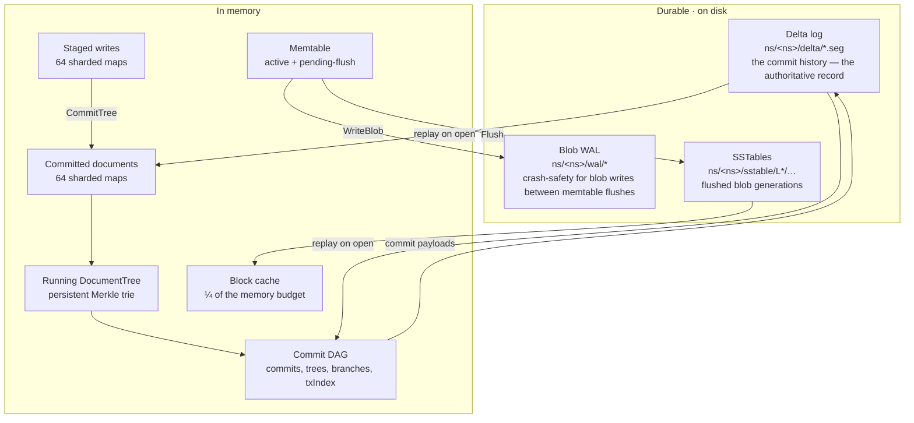
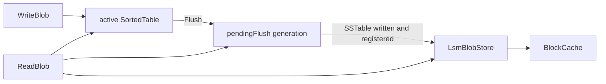

# KDB — Low-Level Design

## Part 4 · Storage — Physical and In-Memory

**Parent:** [Part 0 — Index & architecture](kdb-lld.md) · **See also:**
[High-level architecture](kdb-architecture.md) · [Components](kdb-lld-components.md) ·
[Flows](kdb-lld-flows.md) · [Concurrency](kdb-lld-concurrency.md) ·
[Query](kdb-lld-query.md) · [Protocol](kdb-lld-protocol.md) ·
[User guide](kdb-user-guide.md)

Everything KDB writes to disk, byte for byte, and everything it keeps in RAM, structure for
structure.

-----

## 1. The storage architecture at a glance

KDB has **two independent durable stores** with different jobs, plus an in-memory working set.



**The critical asymmetry:** the delta log holds *commits* and is what a restart rebuilds
everything from. The WAL and SSTables hold *blobs* (attachment payloads and codec bodies) and are
a performance/crash-safety mechanism for that store only. A namespace's documents are recoverable
from the delta log alone — which is why backup, verify, and restore all operate on the delta log.

-----

## 2. On-disk layout

```
<dataRoot>/
├── .kdb.lock                       ATTACH lock — shared by every runtime, exclusive for maintenance
├── .kdb.write.lock                 WRITER lock — exclusive, held only by a writable runtime;
│                                   holds "pid=…\nruntime=…"
├── costmodel.json                  learned scan-cost priors (kdb-service; a cache — safe to delete)
└── ns/
    └── <namespaceId>/              e.g. myapp/users → ns/myapp/users/
        ├── meta.json               {"namespaceId":"…"}
        ├── meta/                   reserved
        ├── delta/
        │   ├── 00000000000000000000.seg    sequence 0  (sealed)
        │   ├── 00000000000000000001.seg    sequence 1  (sealed)
        │   └── 00000000000000000002.seg    sequence 2  (active — appended to)
        ├── wal/
        │   ├── <walId>                     first segment of the chain
        │   └── <walId>.00000000000000004096   rotated segment, named by first sequence
        ├── sstable/
        │   └── L0/<fileId>                 one sealed SSTable per flush
        └── quarantine/                     only after kdb-inspect repair-segments
            └── <seq>.quarantine-<n>
```

Rules the naming scheme encodes:

| Rule | Why |
|------|-----|
| Delta segment names are **20-digit zero-padded decimal sequence numbers** | lexicographic order *is* commit order, for every `ListSegments` implementation and every object store |
| A non-conforming delta name is a **legacy** name and is refused, not guessed at | pre-Layer-13 random-UUID names cannot be ordered; `LegacySegmentFormatError` names the repair command |
| `OpenWriter` always starts a **new** segment at `maxSeq+1` | resuming a previous run's possibly-unsealed segment would need persisted seal state; one extra small segment per restart is the cheaper trade |
| WAL rotation appends `.{firstSequence}` (zero-padded) | a sealed WAL segment's last sequence is its successor's `firstSequence − 1`, which is all truncation needs |
| Every segment path must start with `ns/` and must not contain `..` | `ValidateSegmentName`, enforced on every shim call |
| Quarantined bytes live **outside** `delta/` | a quarantine file inside `delta/` would parse as a legacy segment and make the namespace unopenable |
| Two lock files, not one | "who may open this directory" and "who may write to it" are different questions — see below |

### 2.1 The two-file lock

| Holder | `.kdb.lock` (attach) | `.kdb.write.lock` |
|--------|----------------------|-------------------|
| writable runtime | shared | **exclusive** |
| read-only runtime | shared | — |
| maintenance (`LockDataDir`, `kdb-inspect`) | **exclusive** | — |

Many readers coexist; at most one writer exists; readers coexist with a *live* writer; maintenance
excludes everyone. A single lock with `LOCK_SH` for readers could not express the third: a replica
would attach only to a directory whose writer had stopped. Mixed versions stay safe because an
older binary takes the attach lock exclusively to write — the worst case is refusing to open, never
two writers. Non-unix platforms have no shared mode and say so rather than degrading.

A read-only runtime opens with `engine.TargetReadOnly`: **no WAL, no delta writer, delta reader
only**, and it creates nothing — no namespace directories, no `meta.json` — because the directory
belongs to the writer. Its view is a snapshot as of the open; `Refresh()` replays whatever the
writer has since made durable.

-----

## 3. Byte formats

### 3.1 Delta segment — KDBP page frame v2

A delta segment is a bare sequence of frames; there is no file header and no footer, so a torn
write can only ever damage the tail.

```
offset  size  field
------  ----  -------------------------------------------------------------
     0     4  magic 'K''D''B''P'  (0x4B 0x44 0x42 0x50)
     4     1  version = 2
     5     1  codec   (0 = none, 1 = zstd)
     6     2  reserved (zero)
     8     4  compressedLength   u32 BE — body bytes only
    12     4  uncompressedLength u32 BE
    16     4  crc32(body)        u32 BE
    20     n  body = [zstd-compressed] commit payload (KDB binary encoding)
```

- The **codec is recorded per frame**, so `--compression` may change between runs without making
  existing segments unreadable, a single segment may mix codecs, and verification can tell a
  codec mismatch from real corruption (v1 could not — readers were told the codec out of band).
- Decompression uses the *recorded* `uncompressedLength` exactly; any other size is corruption.
- Scanning stops cleanly when a frame's declared length runs past the end of the file — the
  expected shape of an unclean shutdown. A **CRC mismatch on a frame that fits** is a
  `CorruptFrameError`, returned together with every commit scanned before it.

### 3.2 WAL record

```
offset  size  field
------  ----  -------------------------------------------------------------
     0     4  magic 0x4B444257 ('KDBW')      u32 BE
     4     4  bodyLength = 13 + payloadLen   u32 BE
     8     8  sequence                       i64 BE
    16     1  kind (0 PutBlob, 1 DeleteBlob, 2 FlushCheckpoint, 3 Marker)
    17     4  crc32(payload)                 u32 BE
    21     n  payload
  21+n     4  crc32(bytes[0 .. 21+n))        u32 BE   — the record CRC
```

Total record size = `bodyLength + 12`. `PutBlob` payload is `contentHash(32) ‖ blobBytes`.
`0x4B444242` ('KDBB') is reserved as a batch marker and terminates a decode pass.

Recovery walks every segment in the chain oldest-first, sorts each segment's records by sequence,
and replays them. With `walSkipCorruptRecords`, a bad magic ends the scan and a bad CRC skips the
record; without it, either is a `CorruptionError` naming the offset.

### 3.3 SSTable

**Block (v2), one per entry:**

```
offset  size  field
------  ----  -------------------------------------------
     0     1  version = 2
     1     1  codec (0 none, 1 zstd)
     2     2  reserved
     4     4  compressedLength   u32 BE (body only)
     8     4  uncompressedLength u32 BE
    12     4  crc32(body)        u32 BE
    16     n  body
```

**Footer, written once at the end of the file:**

```
magic 0x4B444253 ('KDBS')   u32 BE
indexLength                 u32 BE
indexBytes                  indexLength bytes:
                            "<keyHex>:<offset>:<compressedSize>" lines joined by '\n'
fileHash                    32 bytes — SHA-256 over (key‖value)* in write order
indexLength (again)         u32 BE   ← the trailer
```

The duplicated `indexLength` **trailer** is what makes the footer locatable at all: a reader
seeks to `size − 4`, reads the index length, and from it derives the footer start
(`size − (40 + indexLength) − 4`). Without it the reader would need the footer's start to find
the length that tells it where the footer starts. Both implementations write the trailer and the
golden fixtures pin the bytes.

`BlockHandle.CompressedSize` stores the **body** length excluding the 16-byte header; `Get` reads
`CompressedSize + 16` bytes at `Offset`.

### 3.4 Segment and snapshot keys

| Kind | Path |
|------|------|
| delta | `ns/{namespaceId}/delta/{sequence:%020d}.seg` |
| WAL (first) | `ns/{namespaceId}/wal/{walId}` |
| WAL (rotated) | `ns/{namespaceId}/wal/{walId}.{firstSequence:%020d}` |
| SSTable | `ns/{namespaceId}/sstable/L{level}/{fileId}` |
| snapshot | `kdb:snap:{enlistmentId}` (key space, not a path) |

### 3.5 Wire frame

Documented with the protocol in [Part 6 §1](kdb-lld-protocol.md); noted here because it is the
one **little-endian** format in the system:

```
0  4  frameLength (including this header)  u32 LE
4  2  messageType                          u16 LE
6  2  protocolVersion                      u16 LE
8  4  correlationId                        u32 LE
12 1  payload encoding tag (0 kdb-binary, 1 json)
13 n  payload
```

### 3.6 Backup objects

| Object | Key |
|--------|-----|
| manifest (written **last**) | `backups/{namespaceId}/{backupId}/manifest.json` |
| sealed segment | `ns/{namespaceId}/delta/{seq:%020d}.seg` — the *shared* key, so incremental backups can reference it |
| active-segment prefix | `backups/{namespaceId}/{backupId}/active-{seq:%020d}.prefix` — backup-scoped, because the live segment may still grow |

```jsonc
{
  "formatVersion": 1,
  "namespaceId": "myapp/users",
  "backupId": "<uuid>",
  "baseBackupId": null,           // set for incremental backups
  "createdAt": "2026-08-31T12:00:00Z",
  "headHashes": { "main": "<64-hex>" },
  "commitCount": 1234,
  "segments": [
    { "sequence": 0, "fileSha256": "…", "sizeBytes": 1048576,
      "key": "ns/myapp/users/delta/00000000000000000000.seg" },
    { "sequence": 2, "fileSha256": "…", "sizeBytes": 4096,
      "key": "backups/myapp/users/<id>/active-00000000000000000002.prefix",
      "verifiedPrefix": true }
  ]
}
```

A backup **exists only once its manifest does** — an interrupted upload leaves orphaned objects
that no manifest names, never a half-valid backup.

-----

## 4. The durability model

### 4.1 Modes

| `--durability` | Blob write (`WriteBlob`) | Commit (`PersistAsync`) | Loss window on crash |
|----------------|--------------------------|--------------------------|----------------------|
| `sync` (default) | append → `GroupCommitter.SyncTo` → return | enqueue → drain appends → fsync → ack | none for acknowledged writes |
| `async` | append → return; background ticker syncs every `--async-sync-interval-ms` (default 5 ms) | ack at enqueue | up to one flush interval / one in-flight batch |
| `memory` | append to memtable only | nothing written | everything |

### 4.2 Sync mode

`--sync-mode` selects the physical primitive every flush uses:

| Mode | macOS | Linux | Survives |
|------|-------|-------|----------|
| `full` (default) | `F_FULLFSYNC` | `fsync` | power loss |
| `fast` | `F_BARRIERFSYNC` | `fdatasync` | process and OS crash, **not** power loss — an order of magnitude cheaper |

### 4.3 What "acknowledged" means

Under `sync`, when `Commit` returns successfully:

1. the commit payload has been framed and appended to the active delta segment, **and**
2. that segment has been flushed with the configured sync primitive, **and**
3. the commit is in the in-memory DAG and `main` points at it.

The delta log is therefore sufficient to reconstruct the namespace, which is why nothing else
needs to be fsynced on the commit path.

### 4.4 Crash consistency

| Failure | Effect | Recovery |
|---------|--------|----------|
| `kill -9` / OOM kill / power loss | possibly a torn final frame | replay tolerates it on the newest segment only |
| disk full mid-append | append error → commit-log failure latch; later commits fail fast | free space, restart; the partial frame is a torn tail |
| corruption in an older segment | replay refuses to open | `kdb-inspect verify` → `repair-segments` → `restore` |
| missing parent after repair | replay names the first unresolved commit | `kdb-inspect restore` from a backup or a second source |
| clean shutdown skipped | one extra unsealed segment | next open scans its tail; no data loss |

**No repair step is ever required for an ordinary crash.** That is the Layer 13 P2 contract:
"restart must never require recovery."

-----

## 5. Replication to object storage

Setting `KDB_S3_BUCKET` wraps the OS byte store in `PrimaryWithReplicas`, which mirrors sealed
segments and snapshots to an S3-compatible target.

| Env var | Meaning |
|---------|---------|
| `KDB_S3_BUCKET` | bucket name; **unset disables S3 entirely** |
| `KDB_S3_REGION` | region (default `us-east-1`) |
| `KDB_S3_ENDPOINT` | custom endpoint (LocalStack/MinIO); implies path-style addressing |
| `KDB_S3_PREFIX` | key prefix |
| `KDB_S3_PATH_STYLE` | force path-style addressing |
| `KDB_S3_ENSURE_BUCKET` | create the bucket if missing (implied by a custom endpoint) |

`ReplicationPolicy` decides whether a replica failure fails the operation (fail-closed) or is
logged and tolerated (fail-open, the default for a replica *tier*).

-----

## 6. In-memory storage

### 6.1 What a running namespace holds

| Structure | Contents | Growth |
|-----------|----------|--------|
| `dag.commits` | every commit, in full, including operations | **monotonic** — nothing evicts history |
| `dag.trees` | every document tree seen | monotonic, but nodes are shared across versions |
| `dag.txIndex` | transaction id → commit hash | monotonic, one entry per commit |
| `dag.hexSorted` | sorted commit hex strings | monotonic |
| `docs` (64 shards) | current committed documents | proportional to live document count |
| `pending` (64 shards) | staged writes | one transaction's worth |
| `tree` | the current `DocumentTree` | O(live documents), heavily shared |
| memtable (active + pending flush) | recent blobs | bounded by flush cadence |
| `BlockCache` | decompressed SSTable blocks | capped at ¼ of `GlobalMemoryBudgetBytes` |
| index `eventLog` + bucket memo | index events, ≤ 8 memoized bucket sets | proportional to indexed writes |
| `CostModel` | ≤ 256 namespaces × ≤ 512 shape cells × 64 samples | bounded, FIFO-evicted |

The monotonic rows are the reason the memory-governance layer exists: **an uncompacted in-memory
commit DAG grows without bound by design**. Admission control turns that into a progressive
throttle rather than an OOM kill (see [Part 3 §9](kdb-lld-concurrency.md)); DAG compaction
(squash) and the ice tier are the mechanisms that actually reclaim it.

### 6.2 Sharded document storage

```
shardIndex = uint64(docID.LSB) % 64
```

UUIDs come from `crypto/rand`, so the low bits are already uniformly distributed — no hashing
step is needed. 64 shards is a fixed power of two so selection is a mask-equivalent modulo, and
each empty shard costs only a mutex plus an empty map header.

| Operation | Cost |
|-----------|------|
| `Get`/`Put`/`Delete` | one shard lock, one map op |
| `Range` (scan) | per shard: lock, copy the shard, unlock, visit unlocked |
| `Snapshot` | two passes (count, then copy) — used only where a full view is required |
| `TakeAllAndClear` (pending) | skips shards with nothing staged, so a one-document commit does not reallocate 128 maps |

### 6.3 The running document tree

`CommitTree` folds staged deletes then puts into the current tree via the persistent trie:

```
cost(commit) = O(changed documents × trie depth)      not O(namespace size)
```

This is what keeps commit latency flat as a namespace grows. `parentTreeHash` is accepted for
interface parity but ignored: `ServerEngine` tracks *current committed state*, not per-branch
history — reading an arbitrary historical tree is a documented limitation
([Part 5 §7](kdb-lld-query.md)).

### 6.4 The blob path in memory



- `SortedTable` keeps insertion order plus a value/tombstone slot per key. `Lookup` distinguishes
  *absent* (keep searching older generations) from *tombstoned* (stop — the key is deleted).
- `Manager.Flush` swaps a fresh active table in, writes the snapshot as an SSTable, registers the
  handle, and **only then** clears `pendingFlush` — clearing it before `Finish()` (the fallible
  step) would make a whole generation unreachable from active, pending, *and* the blob store.
- `LsmBlobStore.Get` searches tables newest-first; `AddTable` copies the slice so a concurrent
  reader keeps a stable backing array.
- Tombstones are dropped at flush (the SSTable format has no delete marker), so a delete of an
  already-flushed blob holds only while its tombstone lives in memory.

### 6.5 Block cache

Byte-capacity FIFO keyed by `(fileHash, blockOffset)`, sized at `GlobalMemoryBudgetBytes / 4`.
`Get` returns a copy so a cached block cannot be mutated by a caller. Eviction drops from the
front until the used total fits.

### 6.6 Memory budget accounting

| Consumer | Governed by |
|----------|-------------|
| in-flight operations | `Admission` grants (bytes, reserved before the work starts) |
| DAG, indexes, goroutine stacks | the **non-granted floor**, re-derived from the measured smoothed usage every 200 ms |
| block cache | its own capacity (¼ of the storage engine budget) |
| per-connection frame buffers | `IncomingQueueFrames` (4) × `MaxFrameBytes` (16 MiB), bounded further by `MaxConnections` |
| rescue reserve | `--memory-reserve-mb`, clamped to ¼ of the budget, really allocated and page-touched |

`DetectMemoryBudgetBytes` picks, in order: the cgroup memory limit (the number the kernel
enforces), else 75 % of host RAM, else 0 (governance disabled). `ApplyGoMemoryLimit` sets
`GOMEMLIMIT` to a fraction that lands deliberately *between* the shed threshold (85 %) and the
critical threshold (93 %), so the GC works harder before admission starts refusing work.

-----

## 7. Storage tiers

| Tier | Meaning | Mechanism |
|------|---------|-----------|
| hot | in memory, immediately queryable | memtable, doc shards, DAG |
| warm | on local disk | delta segments, SSTables |
| cold | remote/object storage | S3 replica sink |
| ice | archived history | `tier.Manager.ArchiveCommit` → `dag.StubCommit`; reading a stubbed commit raises `IceStorageError` carrying the archive location |

Tier thresholds are declared per namespace in the policy (`TierPolicy`, `TierBand`,
`IceTierBand`); Layer 4b's tier signals feed the tier manager. In the Go tree the signal plumbing
and stub model are implemented; automatic band promotion/demotion is minimal and fuller on the
Kotlin side.

-----

## 8. Space and compaction

Two distinct compactions, easily confused:

| Name | Module | What it merges |
|------|--------|----------------|
| **Storage compaction** | `kdb-storage-compaction` (Kotlin), Layer 4a component 10f | SSTable generations — physical space |
| **DAG compaction** | `compaction` (Go) / `:kdb-compaction`, Layer 6 component 19 | commit history via `dag.Squash` — logical space |

DAG compaction is gated by policy (`squashAfter=NEVER` blocks it outright) and by peer safety: a
boundary that a peer still needs cannot be squashed, which is what
`CompactionSafetyError` reports.

-----

## 9. Operational sizing

Rules of thumb implied by the structures above:

| Quantity | Estimate |
|----------|----------|
| retained bytes per commit | ≈ 8 KiB + 1.5 × payload bytes (measured; the cost model biases high on purpose) |
| document tree node cost | one node per distinct nibble path; unchanged subtrees are shared |
| delta segment size | grows until the process restarts (a new segment starts per open) |
| WAL segment size | rotates at `walMaxSegmentBytes`, default 64 MiB |
| block cache | 25 % of `GlobalMemoryBudgetBytes` (64 MiB default for file runtimes → 16 MiB cache) |
| per connection | 4 frames × ≤ 16 MiB worst case + one goroutine stack |

-----

## Cross-references

- Who writes these files, and when: [Part 2 — Flows](kdb-lld-flows.md)
- Which locks guard each structure: [Part 3 — Concurrency](kdb-lld-concurrency.md)
- The types behind each format: [Part 1 — Components](kdb-lld-components.md)
- Operator procedures (backup, verify, restore): [User guide](kdb-user-guide.md)
