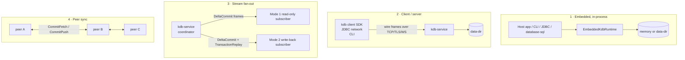
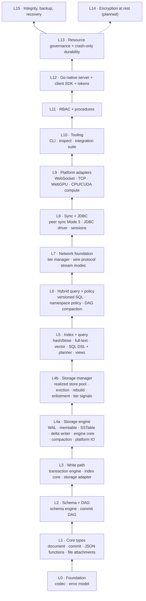
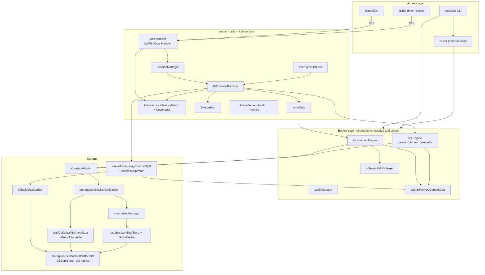
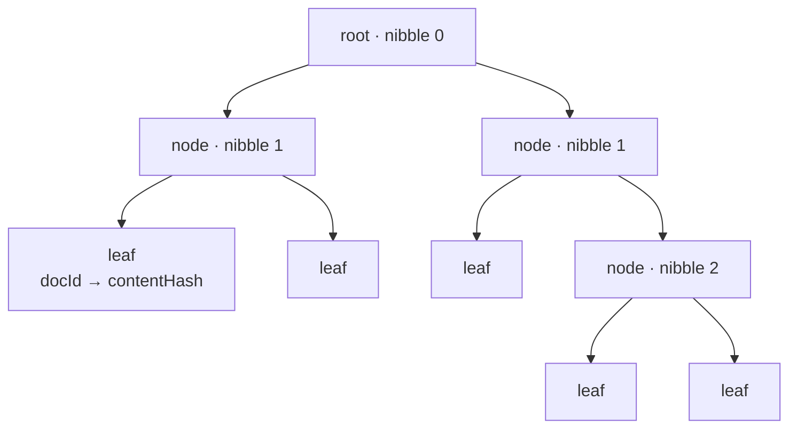

# KDB — Low-Level Design

## Part 0 · Index, System Architecture, and Core Data Model

**Document version:** v1.0 · **Covers repository version:** `VERSION` = 0.1.0
**Status:** descriptive — this document describes *what the code does today*, not what the
[architecture specification](kdb-spec.md) plans. Where implementation and spec differ, the
difference is called out explicitly.

-----

## 0. How to read this documentation

This is a seven-part low-level design (LLD). It starts at the system boundary and descends to
byte layouts and lock ordering. Read the parts in order for a full tour; jump straight to a part
if you know what you are looking for.

| Part | Document | Contents |
|------|----------|----------|
| **0** | **this file** | Reading guide, system architecture, deployment topologies, layer stack, module/package maps, the core data model (document, commit, Merkle document tree, branches), hashing and content addressing, glossary |
| **1** | [Component & class reference](kdb-lld-components.md) | Every package and every significant type: what it is, what it owns, its key methods, its invariants |
| **2** | [Flows](kdb-lld-flows.md) | End-to-end sequence diagrams: open, put, get, SQL select, commit over the wire, conflict, replay, peer sync, stream fan-out, crash recovery, backup/restore, shutdown |
| **3** | [Concurrency model](kdb-lld-concurrency.md) | Every goroutine, every lock, lock ordering, atomicity and visibility rules, backpressure, group commit, admission control, known hazards |
| **4** | [Storage](kdb-lld-storage.md) | Physical on-disk layout and byte-level formats (delta log, WAL, SSTable, segment naming, lock file), and the in-memory storage (memtable, shards, caches, DAG) |
| **5** | [Query engine and KDB-SQL](kdb-lld-query.md) | The query language (grammar, semantics, `_doc`, versioned reads), parser → planner → executor pipeline, DML/DDL, JDBC and `database/sql` mapping, cost/shape model |
| **6** | [Wire protocol, transports, governance, security, operations](kdb-lld-protocol.md) | Frame format, message catalogue, handshake and sessions, transports, resource governance, error taxonomy, RBAC, TLS, metrics |

Higher-level and end-user material lives alongside this set and is kept in sync with it:

- [**High-level architecture**](kdb-architecture.md) — what the system is, the container view, the
  key decisions and their rationale, quality attributes, risks. **Start here** if you are new.
- [**User guide**](kdb-user-guide.md) — how to run, embed, and operate KDB
- [**Architecture specification**](kdb-spec.md) — the normative design, layer plans, and roadmap
- Per-component specs — `docs/kdb-spec-layer*.md`, referenced from each section below

### A note on "CQL"

KDB has no language named CQL. Its query language is **KDB-SQL**: a SQL subset that treats the
JSON document as the truth and the schema as an optional typed lens over it, exposed through the
`_doc` and `kdb_id` pseudo-columns and extended with git-style version clauses
(`AT VERSION` / `AT COMMIT` / `AT TIME`). Everything a caller can express, and exactly how each
construct executes, is documented in [Part 5](kdb-lld-query.md).

### Conventions used in this document

- Go identifiers are written `package.Type.Method`; Kotlin identifiers `Module::Class.method`.
- File references are clickable: [`go/kdb/storage/engine/server_engine.go`](../go/kdb/storage/engine/server_engine.go).
- "Server" means a `kdb-service` process; "embedded" means the engine linked into a host process
  (CLI, JDBC, `database/sql`, WASM, gomobile).
- Byte layouts are big-endian unless stated; the *wire frame header* is the one deliberate
  exception (little-endian, see Part 6).

-----

## 1. What KDB is

KDB is a **portable embedded database engine that stores whole JSON documents in a git-like
versioned history**. The mental model is source control for structured data:

```
document        = a whole JSON object, addressed by UUID, hashed by content
commit          = an immutable snapshot of the whole namespace, with parents
namespace       = an independently versioned store ("myapp/users"), with branches
peer            = a fully independent replica that may diverge and merge
schema          = an optional typed lens that makes SQL and indexes possible
```

Four properties follow from that model and shape every design decision below:

1. **Content addressing.** Documents, document trees, commits, and schemas are identified by
   SHA-256 of their canonical encoding. Unchanged content is shared between versions for free.
2. **Append-only history.** Commits are never mutated. A branch is a movable pointer into an
   immutable DAG. Deleting data means writing a new commit whose tree omits it.
3. **Divergence is normal.** Two peers may accept conflicting writes. The engine classifies
   (fast-forward / already-ancestor / diverged), auto-merges only when documents are disjoint,
   and otherwise surfaces a structured conflict report rather than silently picking a winner.
4. **The document is the truth; the schema is a lens.** A namespace with no schema still stores
   and returns documents. Declaring a schema adds typed columns and indexes over fields that
   happen to exist; it never constrains what else the document may contain.

### 1.1 Two implementations, one specification

| | Kotlin Multiplatform | Go |
|---|---|---|
| Location | repo root, 56 Gradle modules (`kdb-*`) | [`go/`](../go) |
| Size (non-test) | ~44 k LOC | ~35 k LOC (239 files) |
| Targets | JVM, Kotlin/JS (browser), Kotlin/Native | native binaries, WASM (`go/wasm`), gomobile (iOS/Android) |
| Entry points | `:kdb-cli`, `:kdb-jdbc`, `:kdb-service`, `:kdb-inspect`, `:kdb-browser-demo` | `kdb`, `kdb-service`, `kdb-inspect`, `kdb/driver` (`database/sql`), `kdb/client` |
| Role | original implementation; JDBC/ORM/browser story | native server, CLI, SDK; the deployment target for services |

Both follow [`docs/kdb-spec.md`](kdb-spec.md) and are held together by **cross-language golden
tests**: the wire frames, the KDB binary codec, the SSTable/delta byte formats, and the PBKDF2
password hashes are byte-identical across the two trees
([`go/testdata/golden`](../go/testdata/golden), `go/kdb/interop`). Any change to an on-disk or
on-wire format must land in both, and per [`docs/go-porting.md`](go-porting.md) format changes
originate on the Kotlin side.

This LLD documents the **Go implementation as the reference**, because it is the deployment
target, and notes Kotlin parity where the two differ materially.

-----

## 2. Deployment topologies

KDB is one engine that runs in four shapes. The engine core is identical in all four; only the
adapters differ.



| Topology | Who uses it | Durability | Concurrency ceiling |
|----------|-------------|-----------|---------------------|
| Embedded memory | tests, browser demo, `jdbc:kdb:memory://`, `kdb://memory:///` | none (process lifetime) | one process; internal locks only |
| Embedded file | `kdb --data-dir`, `jdbc:kdb:file://`, `kdb://file://` | delta log + WAL, fsync per commit by default | **one writer**, plus any number of read-only attachments — a two-file lock (`.kdb.lock` shared, `.kdb.write.lock` exclusive) |
| Embedded file, read-only | `embed.OpenReadOnlyFileRuntime` | none (reads a live writer's log) | many, alongside the writer; unix only |
| Server | `kdb-service` + `kdb/client`, JDBC network, `kdb-cli sync` | same as embedded file | many connections; one commit at a time per namespace (write gate) |
| Peer mesh | `kdb-service --peer-addr`, `kdb-peer-sync` | per peer | peers are fully independent; divergence resolved on contact |

A single `kdb-service` process serves **one namespace** per `KdbServerRuntime`
(`ServerRuntimeRegistry` exists for multi-namespace hosting but the service binary wires one).

-----

## 3. The layer stack

The specification organises the system into layers 0–15. The code follows that organisation
exactly: each layer only depends on layers below it, and each numbered component maps to a Go
package and a Gradle module.



### 3.1 Go package map

Every package in [`go/kdb`](../go/kdb), what it owns, and which layer it implements. Detailed
type-by-type documentation is in [Part 1](kdb-lld-components.md).

| Package | Layer | Owns |
|---------|-------|------|
| `codec` | 0 | KDB binary codec: `Value` sum type, LEB128/LE primitives, `UUID`, `Hash`, `Timestamp`, schema-driven encode/decode |
| `codec/schema` | 0 | codec type system: physical kinds, logical annotations, record/enum/fixed schemas, `Registry` |
| `error` | 0 | stable numeric error codes, typed exceptions, `Result[T]`, conflict/violation payloads |
| `json` | 1 | JSON parser/writer, typed `Value` tree, JSONPath compile/get/set/delete/merge |
| `document` | 1 | `Document`, `Commit`, `DocumentTree` (Merkle trie), `Op` union, `Branch`/`Tag`/`CommitStub`, SHA-256 |
| `file` | 1 | file attachment records (blob-backed) |
| `schema` | 2 | `KdbSchema`, `Field`, `FieldType`, validation, migrations, diffing, wire encoding |
| `dag` | 2 | `InMemoryCommitDag`: commits, trees, branches, tags, ancestry, walk, diff, squash |
| `transaction` | 3 | `Engine` (commit/replay/merge/validate), conflict detection and policies, `Builder`, `LockManager` |
| `index` | 3, 5 | index `Store` interface, typed `Key`, versioned replay engine, event log with bucket memo, memory store |
| `storage` | 3 | `Adapter` interface, capability set, delta types, `PlatformIOShim`, engine config, memory budget |
| `storage/mem` | 3 | in-memory adapter (sharded docs, pending stage, blob shard) |
| `storage/engine` | 4a | `ServerEngine` — LSM engine + WAL + staged writes + running document tree |
| `storage/wal` | 4a | write-ahead log: records, framing/CRC, segment rotation, recovery, truncation, `GroupCommitter` |
| `storage/memtable` | 4a | `SortedTable` (with tombstones) and the flush `Manager` |
| `storage/sstable` | 4a | SSTable writer/reader, block framing (v2), footer, `BlockCache`, `LsmBlobStore` |
| `storage/delta` | 4a | delta segment writer/reader/scanner, KDBP page frame (v2), sequenced segment factory |
| `storage/io` | 4a/g | `FileBackedPlatformIO`, `OSByteStore`, in-memory store, segment naming, replica fan-out, sync modes |
| `storage/io/s3` | 4a/g | S3-compatible replica sink and blob store |
| `storage/manager` | 4b | realized store pool / eviction / rebuild / enlistment skeleton |
| `compression` | 4a | zstd wrapper, CRC-32 |
| `tier` | 7 | hot/warm/cold/ice tier signals and archive hooks |
| `policy` | 6 | namespace policy model, DSL/JSON parser, validator, presets, registry, compaction boundary evaluator |
| `compaction` | 6 | DAG compaction (squash) orchestration |
| `sql` | 5 | KDB-SQL parser, planner, executor, predicates, aggregates, DML/DDL, query shape fingerprint |
| `query/hybrid` | 6 | version-aware SQL (`AT VERSION`/`AT COMMIT`/`AT TIME`), checkout store, version resolver |
| `wire` | 7 | frame header codec, message catalogue, payload DTOs, handshake negotiation, transaction/commit codecs, error codes |
| `stream` | 7 | Mode 1/2 coordinator, subscriber, in-memory transport hub, index-hint applier |
| `transport/core` | 9 | transport options, TLS settings, frame admitter, framing helpers |
| `transport/tcp`, `transport/ws` | 9 | TCP and WebSocket transports with length-prefixed framing, backpressure, connection caps |
| `peersync` | 8/12 | Mode 3 host/client, sync plan, head-update classification, divergence resolution and auto-merge |
| `auth` | 11 | principals, credentials, actions, permission matching, PBKDF2 hashing, registry-backed engine |
| `server` | 12/13 | `KdbServerRuntime`, wire/stream/peer listeners, sessions, write gate, memory guard, admission, cost model, abort watchdog, admin HTTP |
| `client` | 12 | Go client SDK: connect, put/get/upsert/commit/query/exec, typed errors |
| `driver` | 12 | `database/sql` driver over the embedded runtime (`kdb://memory:` / `kdb://file:`) |
| `embed` | 12 | `EmbeddedKdbRuntime`, memory/file runtimes, directory lock, delta replay, persisting DAG, commit-log writer, auth registry |
| `integrity` | 15 | L1/L2 verification, findings, repair (torn tail, quarantine), genesis reconstruction |
| `backup` | 15 | manifest-defined backup create/verify/list/fetch, object stores |
| `recovery` | 15 | hybrid restore: union of verified sources, topological rewrite |
| `inspect` | 10 | wire frame inspector (debug JSON views) |
| `config` | — | product config, `kdb-service` settings resolution (defaults < file < env < flags) |
| `metrics` | — | per-stage latency recorder (`lock_wait`, `fsync_wait`, `tree_rebuild`) |
| `version` | — | build identity (version, commit, dirty flag, build date) |
| `compute`, `compute/webgpu` | 9 | GPU/CPU compute adapter surface |
| `interop` | — | cross-language interop tests against the JVM implementation |

Binaries in [`go/cmd`](../go/cmd): `kdb` (CLI), `kdb-service` (server), `kdb-inspect`
(verify/repair/backup/restore), `kdb-loadtest`, `kdb-pressure-test`, `kdb-e2e-helper`.

### 3.2 Kotlin module map

| Module group | Modules | Mirrors Go package |
|--------------|---------|--------------------|
| Foundation | `kdb-error`, `kdb-codec`, `kdb-json`, `kdb-document`, `kdb-file` | `error`, `codec`, `json`, `document`, `file` |
| Schema + DAG | `kdb-schema`, `kdb-dag` | `schema`, `dag` |
| Write path | `kdb-transaction`, `kdb-index`, `kdb-storage` | `transaction`, `index`, `storage` |
| Storage engine | `kdb-storage-io`, `-wal`, `-sstable`, `-memtable`, `-delta`, `-engine`, `-compaction`, `-chunking`, `-manager`, `kdb-compression` | `storage/*` |
| Index impls | `kdb-index-hash`, `-btree`, `-fulltext`, `-vector`, `-composite` | `index` (Go ships the shared engine only) |
| Query | `kdb-sql`, `kdb-hybrid-query`, `kdb-namespace-policy`, `kdb-compaction` | `sql`, `query/hybrid`, `policy`, `compaction` |
| Network | `kdb-wire`, `kdb-stream`, `kdb-storage-tier`, `kdb-peer-sync`, `kdb-transport-core/-tcp/-ws` | `wire`, `stream`, `tier`, `peersync`, `transport/*` |
| Access | `kdb-jdbc`, `kdb-embed`, `kdb-server`, `kdb-service`, `kdb-cli`, `kdb-inspect` | `driver`/`client`, `embed`, `server`, `cmd/*` |
| Security | `kdb-auth`, `kdb-auth-static`, `kdb-auth-store` | `auth` |
| Ops | `kdb-integrity`, `kdb-recovery`, `kdb-config` | `integrity`, `recovery`, `config` |
| Extras | `kdb-script` (sandboxed JS stored procedures), `kdb-compute*`, `kdb-benchmark`, `kdb-browser-demo`, `kdb-integration` | — (`kdb-script` has no Go counterpart yet) |

-----

## 4. Runtime composition

The single most useful diagram in this document: what actually exists at runtime inside one
process, and who calls whom.



**Read this diagram as three concentric rings.** The engine core (`transaction`, `sql`, `dag`,
`schema`) has no knowledge of servers, sockets, or sessions — it is what the embedded runtime
exposes directly. The server ring adds admission, sessions, and listeners around it without
changing its semantics. The storage ring is reached only through `storage.Adapter`.

-----

## 5. The core data model

Everything above L2 manipulates five types. They are defined in
[`go/kdb/document`](../go/kdb/document) and [`go/kdb/codec`](../go/kdb/codec).

### 5.1 Identifiers and hashes

| Type | Representation | Notes |
|------|----------------|-------|
| `codec.UUID` | `{MSB, LSB int64}` | RFC 4122; `RandomUUID()` uses `crypto/rand`; canonical lowercase string form |
| `codec.Hash` | `[32]byte` | SHA-256 (RFC 6234). Hex form is the wire/CLI representation |
| `codec.Timestamp` | `{EpochMillis int64, MicroRemainder int32}` | microsecond resolution; `EpochMicros()` is the comparison key |

Content addressing rules — memorise these, everything else follows:

```
documentContentHash = SHA256( canonical KDB-binary encoding of {id, json} )
documentTreeHash    = Merkle root over (docId → contentHash), see §5.3
schemaHash          = SHA256( canonical encoding of the schema snapshot )
commitHash          = SHA256( canonical encoding of the commit payload,
                              which includes parents, tree hash, ops, schema hash,
                              namespace, transaction id, author, timestamp, message )
```

The consequence: a commit hash covers the *entire* reachable state, so verifying a commit hash
verifies its whole history transitively.

### 5.2 `document.Document`

```go
type Document struct {
    ID   codec.UUID
    JSON string   // exactly the bytes the caller supplied, with "id" ensured
}
```

Invariants:

- The JSON root **must be an object** (`validateObjectJSON`); arrays and scalars are rejected.
- `EnsureIDInJSON` guarantees the document's own `id` field matches `ID` — a caller-supplied
  `id` must be a string parsable as a UUID (a non-string `id` is a hard error, never silently
  replaced).
- `Merge(patchJSON)` is a shallow root-level merge (`json.Merge`), used by `WriteOp` to turn a
  patch into a full document against the base version.
- `ContentHash()` encodes the document body through the KDB codec and hashes it — never the raw
  JSON text — so formatting differences do not change identity.

### 5.3 `document.DocumentTree` — the Merkle trie

The document tree is the snapshot: a mapping from document id to content hash, hashed as a
16-way radix trie over the UUID's nibbles
([`document_tree_trie.go`](../go/kdb/document/document_tree_trie.go)).



| Property | Value | Why it matters |
|----------|-------|----------------|
| Node fan-out | 16 (one nibble of the UUID) | depth ≤ 32; typically ~2–5 for real namespaces |
| Leaf hash | `SHA256(uuidBytes ‖ contentHash)` | a document's position and content both bind |
| Internal hash | `SHA256(child hashes in slot order, absent = zero)` | order-independent of insertion |
| `With` / `Without` | **persistent** — returns a new tree sharing all untouched nodes | commit cost is O(depth), not O(namespace) |
| `Size()` | tracked, O(1) | used as the cardinality input to the query cost model |
| `MaterializedEntries()` | lazily built map | avoided on the hot path deliberately |

The persistence property is load-bearing: `ServerEngine.CommitTree` applies staged writes to a
running tree incrementally (O(changed documents)) instead of rebuilding from a full document
snapshot, which is what makes commit latency independent of namespace size.

### 5.4 `document.Op` — the operation union

| Op | Fields | Effect at commit |
|----|--------|------------------|
| `WriteOp` | `DocID`, `Patch` (JSON) | merge patch onto base document (or create), validate against schema, stage a `PutDocument` |
| `DeleteOp` | `DocID` | stage a `DeleteDocument`; tree loses the entry |
| `FileWriteOp` | `DocID`, `Path`, `BlobHash`, size, media type | preflighted: the blob must already exist in storage, else a schema violation |
| `SchemaMigrationOp` | `MigrationPayload` | applies a migration step to the *rolling* schema used for validating later ops in the same transaction |

Ops are ordered within a transaction and applied in order; the schema phase carries a rolling
schema forward so a migration op affects subsequent writes in the same transaction.

### 5.5 `document.Commit`

```go
type Commit struct {
    Hash             codec.Hash     // SHA-256 of the payload below
    ParentHashes     []codec.Hash   // 0 = genesis, 1 = normal, 2 = merge
    NamespaceID      string
    TransactionID    codec.UUID     // idempotency key
    Timestamp        codec.Timestamp
    AuthorNodeID     codec.UUID
    Operations       []Op
    DocumentTreeHash codec.Hash
    SchemaHash       *codec.Hash
    Message          string
}
```

- `BuildCommit(...)` computes the hash; `ComputeCommitHash(c)` re-derives it for verification.
- A commit arriving from *outside* (peer push, delta replay) is hash-verified on insert
  (`PutCommit` → `putCommitLocked(verifyHash=true)`); a commit the local engine just built is
  not re-hashed (`AppendCommit` path), because that would be pure duplicated work on the hot
  path.
- `TransactionID` is indexed (`dag.txIndex`) so a retried transaction returns the original
  commit instead of creating a duplicate — this is what makes client retries idempotent.

### 5.6 Branches, tags, and stubs

| Type | Meaning |
|------|---------|
| `Branch{Name, NamespaceID, HeadHash, CreatedAt, UpdatedAt}` | movable pointer; `main` always exists and cannot be deleted |
| `Tag` | immutable named pointer (model present; CLI surface partial) |
| `CommitStub{OriginalHash, ArchiveLocation, StubbedAt}` | a commit whose body has been archived to the ice tier; reading it raises `IceStorageError` with the archive location |

Every namespace's DAG is created with a deterministic **genesis commit**: fixed transaction id
`0000…0001`, fixed author `0000…0002`, zero timestamp, empty tree, message `"genesis"`, with the
namespace id mixed into the payload. Genesis is therefore reproducible from the namespace name
alone (`integrity.GenesisCommitHash`) and is **never written to the delta log** — which is why
verification must not report a first commit's parent as missing.

### 5.7 Schema — the optional lens

```go
type KdbSchema struct {
    SchemaHash  codec.Hash
    Fields      []Field       // name, FieldType, Required, Indexed, Unique
    Version     int
    CreatedAt   codec.Timestamp
    Description string
}
```

- `schema.None()` is the sentinel for schema-less namespaces; `IsNone()` compares hashes.
- Field types: `String, Int32, Int64, Float64, Bool, Timestamp, UUID, Object, Array, Enum`, each
  with a `SQLTypeName()` (what JDBC/metadata reports) and a `CodecTypeLabel()`.
- `Validate(doc, schema)` returns a `Result[Document]`; failures carry `FieldViolation` lists.
- Migrations are an ordered step list (`AddField`, `DropField`, `RenameField`, `ChangeType`,
  `AddIndex`, `DropIndex`, `SetRequired`, `SetUnique`, `WidenEnum`, `NarrowEnum`); `IsBreaking`
  classifies each step, and `DiffSchemas` produces a human-readable delta.

Full semantics: [Part 5 §2](kdb-lld-query.md).

-----

## 6. Namespaces and catalogs

A namespace id is a slash-separated path, conventionally `catalog/collection`
(`myapp/users`). It is:

- the **DAG scope** — one `InMemoryCommitDag` per namespace, with its own `main` branch;
- the **storage scope** — segments live under `ns/{namespaceID}/…`;
- the **RBAC scope** — grants are matched against `namespace/collection/document` paths;
- the **SQL scope** — one namespace behaves as one table; `FROM users` selects from the
  connection's namespace regardless of the name used (the planner does not resolve table names
  against a catalog yet).

Two reserved namespaces exist for the durable RBAC registry: `_system/users` and `_system/roles`
(`auth.UsersNamespace` / `auth.RolesNamespace`), stored through the same delta-log machinery as
user data.

-----

## 7. Design rules the code enforces

These are the invariants everything else in this LLD refers back to. Each is enforced at a
specific place in the code, named here.

| # | Rule | Enforced by |
|---|------|-------------|
| R1 | A write is not visible to readers until its commit is appended | `ServerEngine` staging (`pending` → `CommitTree`) |
| R2 | A failed write phase leaves no partial state | `Adapter.DiscardPending` + `ResultAborted` |
| R3 | An acknowledged commit is durable (under `--durability=sync`) | `commitLogWriter.Enqueue` waits for fsync before ack |
| R4 | Restart never requires a repair step | `replayDeltaNamespace` + topological apply; torn tail tolerated |
| R5 | Commit order in the delta log equals commit order in the DAG | queueing happens under the write gate; one drain goroutine |
| R6 | A retried transaction yields the original commit, not a duplicate | `dag.GetCommitByTransactionID` + `findExistingCommit` |
| R7 | A commit from an untrusted source is hash-verified before insertion | `PutCommit(verifyHash=true)` |
| R8 | A branch pointer only moves fast-forward, or via an explicit merge/conflict decision | `peersync.ResolveHeadUpdate` / `ResolveDivergence` |
| R9 | Work is admitted only if its estimated memory is available and reserved | `server.Admission.Acquire` |
| R10 | Every failure reaches the client as a typed, actionable code | `wire.ErrorCode` + `classifyError` |
| R11 | Point reads are never shed | `admitInZone` |
| R12 | One writer per data directory; many readers may attach alongside it | `embed` two-file lock: `.kdb.lock` shared (attach) + `.kdb.write.lock` exclusive (writer) |
| R13 | On-disk and on-wire formats are byte-identical across Kotlin and Go | golden fixtures in `go/testdata/golden`, `go/kdb/interop` |
| R14 | A `unique` schema field admits at most one document per value | `transaction.UniqueKeyRegistry`, checked and applied inside the write gate |
| R15 | A declared precondition is evaluated against the tree the transaction actually lands on | `transaction.evaluatePreconditions`, inside the write gate |
| R16 | A lease holder that stalls past its deadline cannot land a write | monotonic fence tokens + `LockManager.ValidateFences` at commit |

-----

## 8. Glossary

| Term | Meaning |
|------|---------|
| **Blob** | content-addressed byte payload in the LSM store (documents, attachments) |
| **Delta log** | the durable, append-only commit log: sequenced `.seg` files of KDBP frames |
| **Delta segment** | one file of the delta log; named by 20-digit zero-padded sequence number |
| **Enlistment** | a client's registered interest in a namespace subset (storage-manager concept) |
| **Grant** | a memory reservation held for the duration of one operation |
| **Ice tier** | archived history; commits become stubs |
| **KDBP frame** | the v2 page frame that wraps one commit payload in a delta segment |
| **Namespace** | independently versioned store, e.g. `myapp/users` |
| **Realized store** | a materialised, queryable projection of a namespace (Layer 4b) |
| **Segment** | any append-only file managed by the platform IO shim (delta, WAL, SSTable) |
| **Torn tail** | the trailing incomplete frame left by an unclean shutdown; tolerated on replay |
| **Write gate** | the bounded, deadline-aware serialization point for commits |
| **Zone** | memory-pressure level: Normal / Elevated / High / Critical |

-----

## 9. Where to go next

- To understand **what a type does**: [Part 1 — Component & class reference](kdb-lld-components.md)
- To understand **how a request executes**: [Part 2 — Flows](kdb-lld-flows.md)
- To understand **what runs in parallel**: [Part 3 — Concurrency](kdb-lld-concurrency.md)
- To understand **what is on disk**: [Part 4 — Storage](kdb-lld-storage.md)
- To understand **the query language**: [Part 5 — Query engine and KDB-SQL](kdb-lld-query.md)
- To understand **the protocol and operations**: [Part 6 — Wire, governance, security](kdb-lld-protocol.md)
